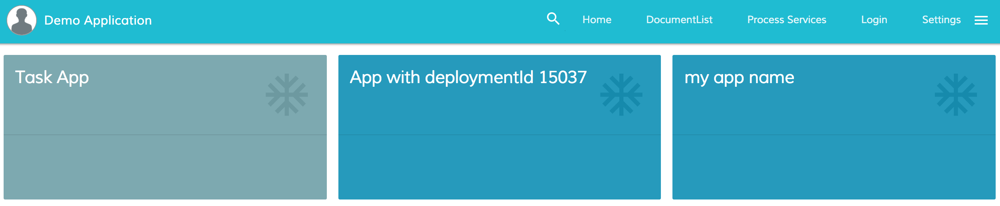
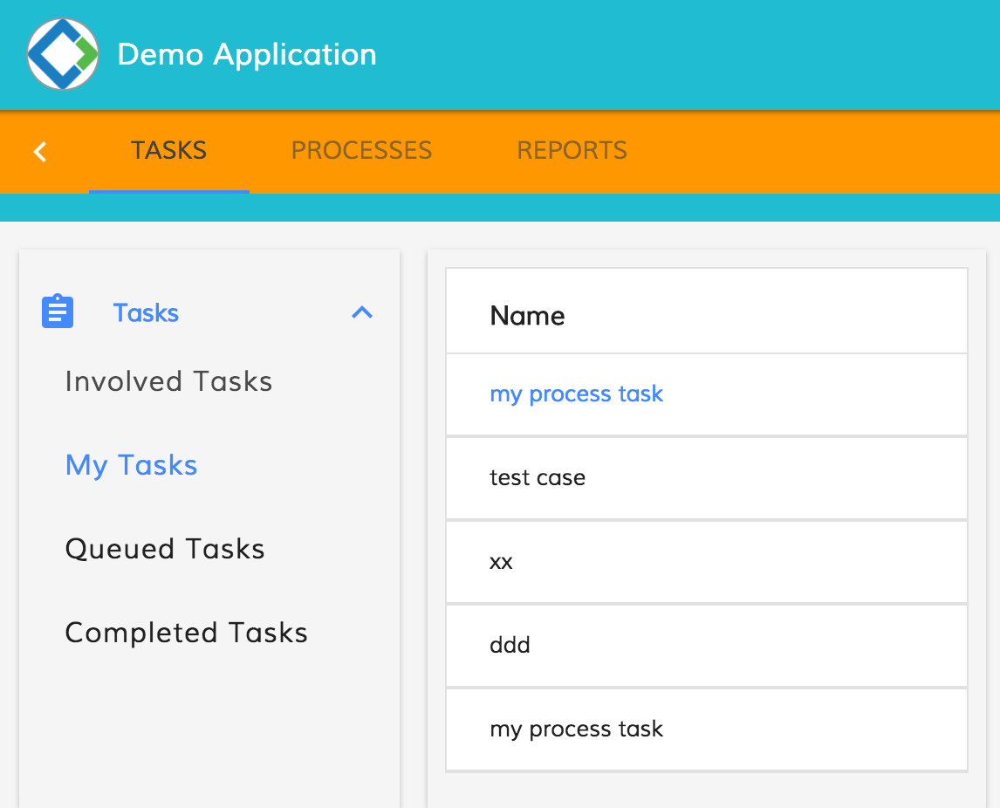
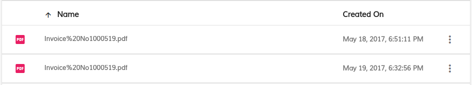
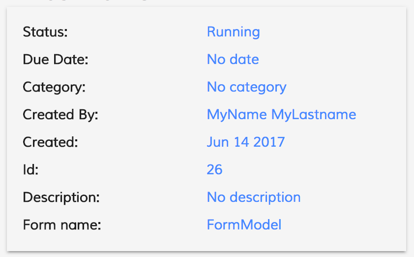
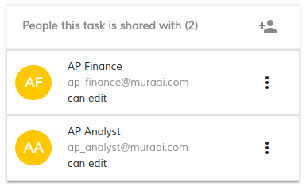
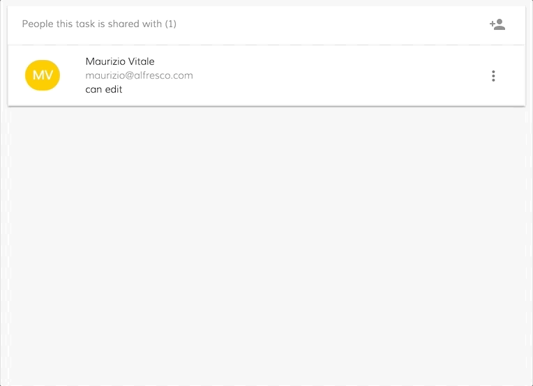
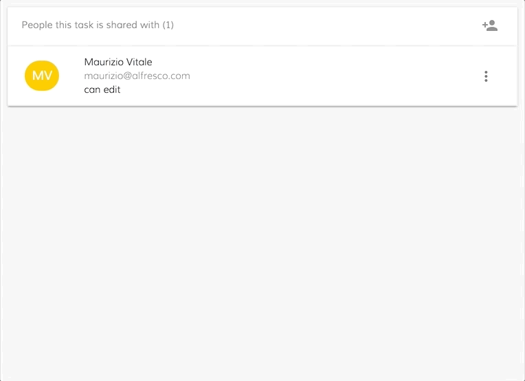
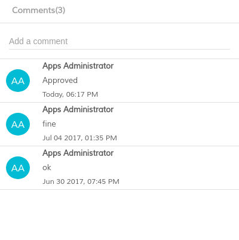
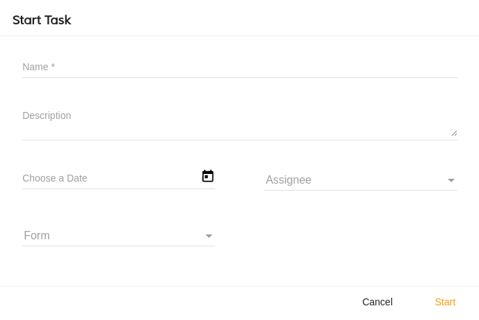
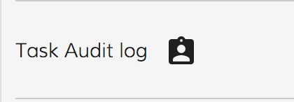

# Activiti Task List library

Contains the Activiti Task List component and other related components and classes.

<!-- markdown-toc start - Don't edit this section.  npm run toc to generate it-->

<!-- toc -->

- [Activiti Task List component](#activiti-task-list-component)
  * [Basic Usage](#basic-usage)
    + [Properties](#properties)
    + [Events](#events)
  * [Details](#details)
    + [DataTableAdapter example](#datatableadapter-example)
    + [DataColumn Properties](#datacolumn-properties)
- [Activiti Task Details component](#activiti-task-details-component)
  * [Basic Usage](#basic-usage-1)
    + [Properties](#properties-1)
    + [Events](#events-1)
  * [Details](#details-1)
    + [Custom 'empty Activiti Task Details' template](#custom-empty-activiti-task-details-template)
- [Activiti Apps Component](#activiti-apps-component)
  * [Basic Usage](#basic-usage-2)
    + [Properties](#properties-2)
    + [Events](#events-2)
  * [Details](#details-2)
    + [How filter the activiti apps](#how-filter-the-activiti-apps)
- [Activiti Filter component](#activiti-filter-component)
  * [Basic Usage](#basic-usage-3)
    + [Properties](#properties-3)
    + [Events](#events-3)
  * [Details](#details-3)
    + [How filter the activiti task filters](#how-filter-the-activiti-task-filters)
    + [FilterParamsModel](#filterparamsmodel)
    + [How to create an accordion menu with the task filter](#how-to-create-an-accordion-menu-with-the-task-filter)
- [Activiti Checklist Component](#activiti-checklist-component)
  * [Basic Usage](#basic-usage-4)
    + [Properties](#properties-4)
- [Task Attachment List Component](#task-attachment-list-component)
  * [Basic Usage](#basic-usage-5)
    + [Properties](#properties-5)
    + [Events](#events-4)
- [Create Task Attachment Component](#create-task-attachment-component)
  * [Basic Usage](#basic-usage-6)
    + [Properties](#properties-6)
    + [Events](#events-5)
- [Activiti Task Header component](#activiti-task-header-component)
  * [Basic Usage](#basic-usage-7)
    + [Properties](#properties-7)
    + [Events](#events-6)
  * [Details](#details-4)
    + [TaskDetailsModel](#taskdetailsmodel)
- [Task People Component](#task-people-component)
  * [Basic Usage](#basic-usage-8)
    + [Properties](#properties-8)
    + [Events](#events-7)
  * [Details](#details-5)
    + [How to customize the people component behavior](#how-to-customize-the-people-component-behavior)
    + [Involve People single click and close search](#involve-people-single-click-and-close-search)
    + [Involve People single click without close search](#involve-people-single-click-without-close-search)
    + [Involve People double click and close search](#involve-people-double-click-and-close-search)
    + [Involve People double double without close search](#involve-people-double-double-without-close-search)
- [ADF Comments Component](#adf-comments-component)
  * [Basic Usage](#basic-usage-9)
    + [Properties](#properties-9)
    + [Events](#events-8)
- [Start Task Component](#start-task-component)
  * [Basic Usage](#basic-usage-10)
    + [Properties](#properties-10)
    + [Events](#events-9)
- [People Search component](#people-search-component)
  * [Basic Usage](#basic-usage-11)
    + [Properties](#properties-11)
    + [Events](#events-10)
  * [Details](#details-6)
- [Task Audit Directive](#task-audit-directive)
  * [Basic Usage](#basic-usage-12)
    + [Properties](#properties-12)
    + [Events](#events-11)
- [Project Information](#project-information)
  * [Prerequisites](#prerequisites)
  * [Install](#install)
  * [Build from sources](#build-from-sources)
  * [NPM scripts](#npm-scripts)
  * [Demo](#demo)
  * [License](#license)

<!-- tocstop -->

<!-- markdown-toc end -->

## Activiti Task List component

Renders a list containing all the tasks matched by the parameters specified.

### Basic Usage

```html
<adf-tasklist 
    [appId]="'1'" 
    [state]="'open'" 
    [assignment]="'assignee'">
</adf-tasklist>
```

You can also use HTML-based schema declaration like shown below:

```html
<adf-tasklist ...>
    <data-columns>
        <data-column key="name" title="NAME" class="full-width name-column"></data-column>
        <data-column key="created" title="Created" class="hidden"></data-column>
    </data-columns>
</adf-tasklist>
```

#### Properties

| Name | Type | Default | Description |
| --- | --- | --- | --- |
| appId | string || The id of the app. |
| processDefinitionKey | string || The processDefinitionKey of the process. |
| processInstanceId | string || The processInstanceId of the process. |
| assignment | string || The assignment of the process. <ul>Possible values are: <li>assignee : where the current user is the assignee</li> <li>candidate: where the current user is a task candidate </li><li>group_x: where the task is assigned to a group where the current user is a member of.</li> <li>no value: where the current user is involved</li> </ul> |
| state | string || Define state of the processes. Possible values are: `completed`, `active` |
| hasIcon | boolean | true | Toggle the icon on the left . |
| landingTaskId | string | | Define which task id should be selected after the reloading. If the task id doesn't exist or nothing is passed it will select the first task |
| sort | string | | Define the sort of the processes. Possible values are : `created-desc`, `created-asc`, `due-desc`, `due-asc` |
| data | DataTableAdapter | | JSON object that represent the number and the type of the columns that you want show (see the [example](#datatableadapter-example) section below) |

#### Events

| Name | Description |
| --- | --- |
| onSuccess | Raised when the task list is loaded |
| rowClick | Raised when the task in the list is clicked |

### Details

This component displays lists of process instances both active and completed, using any defined process filter, and
render details of any chosen instance.

#### DataTableAdapter example

```json
[
 {"type": "text", "key": "id", "title": "Id"},
 {"type": "text", "key": "name", "title": "Name", "cssClass": "full-width name-column", "sortable": true},
 {"type": "text", "key": "formKey", "title": "Form Key", "sortable": true},
 {"type": "text", "key": "created", "title": "Created", "sortable": true}
]
```

#### DataColumn Properties

Here's the list of available properties you can define for a Data Column definition.

| Name | Type | Default | Description |
| --- | --- | --- | --- |
| key | string | | Data source key, can be either column/property key like `title` or property path like `createdBy.name` |
| type | string (text\|image\|date) | text | Value type |
| format | string | | Value format (if supported by components), for example format of the date |
| sortable | boolean | true | Toggles ability to sort by this column, for example by clicking the column header |
| title | string | | Display title of the column, typically used for column headers |
| template | `TemplateRef` | | Custom column template |
| sr-title | string | | Screen reader title, used for accessibility purposes |
| class | string | | Additional CSS class to be applied to column (header and cells) |

## Activiti Task Details component

Shows the details of the task id passed in input

### Basic Usage

```html
<adf-task-details 
    [taskId]="taskId">
</adf-task-details>
```

#### Properties

| Name | Type | Default | Description |
| --- | --- | --- | --- |
| taskId | string | | (**required**) The id of the task details that we are asking for. |
| showNextTask | boolean | true | Automatically render the next one, when the task is completed. |
| showFormTitle | boolean | true | Toggle rendering of the form title. |
| readOnlyForm | boolean | false | Toggle readonly state of the form. Enforces all form widgets render readonly if enabled. |
| showFormRefreshButton | boolean | true | Toggle rendering of the `Refresh` button. |
| showFormSaveButton | boolean | true| Toggle rendering of the `Save` outcome button. |
| showFormCompleteButton | boolean | true | Toggle rendering of the Form `Complete` outcome button |
| peopleIconImageUrl | string | | Define a custom people icon image |
| showHeader | boolean | true | Toggle task details Header component |
| showHeaderContent | boolean | true | Toggle collapsed/expanded state of the Header component |
| showInvolvePeople | boolean | true | Toggle `Involve People` feature for Header component |
| showComments | boolean | true | Toggle `Comments` feature for Header component |
| showChecklist | boolean | true | Toggle `Checklist` feature for Header component |
| fieldValidators | FormFieldValidator[] | [] | Field validators for use with the form. |

#### Events

| Name | Description |
| --- | --- |
| formLoaded | Raised when form is loaded or reloaded. |
| formSaved | Raised when form is submitted with `Save` or custom outcomes.  |
| formCompleted | Raised when form is submitted with `Complete` outcome.  |
| taskCreated | Raised when a checklist task is created.  |
| executeOutcome | Raised when any outcome is executed, default behaviour can be prevented via `event.preventDefault()` |
| onError | Raised at any error |

### Details

#### Custom 'empty Activiti Task Details' template

By default the Activiti Task Details provides the following message for the empty task details:

```html
No Tasks
```

This can be changed by adding the following custom html template:

```html
<adf-task-details [taskId]="taskId">
    <no-task-details-template>
        <template>
             <h1>Sorry, no tasks here</h1>
             
        </template>
    </no-task-details-template>
</adf-task-details>    
```

Note that can put any HTML content as part of the template, including other Angular components.

## Activiti Apps Component

Shows all available apps.

### Basic Usage

```html
<adf-apps 
    [layoutType]="'GRID'">
</adf-apps>
```

#### Properties

| Name | Type | Description |
| --- | --- | --- |
| layoutType | string | (**required**) Define the layout of the apps. There are two possible values: GRID or LIST. |
| filtersAppId | Object | Provide a way to filter the apps to show. |

#### Events

| Name | Description |
| --- | --- |
| appClick | Raised when an app entry is clicked |

### Details

#### How filter the activiti apps

If you want to show some specific apps you can specify them through the filtersAppId parameters

```html
<adf-apps 
    [filtersAppId]="'[
        {defaultAppId: 'tasks'}, 
        {deploymentId: '15037'}, 
        {name : 'my app name'}]'">
</adf-apps>
```

In this specific case only the Tasks app, the app with deploymentId 15037 and the app with "my app name" will be showed


You can use inside the filter one of the following property 

```json
{ 
    "defaultAppId": "string", 
    "deploymentId": "string", 
    "name": "string", 
    "id": "number", 
    "modelId": "number",
    "tenantId": "number"
}
```

## Activiti Filter component

Shows all available filters.

### Basic Usage

```html
<adf-filters></adf-filters>
```

#### Properties

| Name | Type | Description |
| --- | --- | --- |
| filterParam | [FilterParamsModel](#filterparamsmodel) | The params to filter the task filter. If there is no match the default one (first filter of the list) is selected |
| appId | string | Display filters available to the current user for the application with the specified ID. |
| `appName` | string | Display filters available to the current user for the application with the specified name. |
| `hasIcon` | boolean | Toggle to show or not the filter's icon. |

If both `appId` and `appName` are specified then `appName` will take precedence and `appId` will be ignored.

#### Events

| Name | Description |
| --- | --- |
| filterClick | Raised when the filter in the list is clicked  |
| onSuccess | Raised when the list is loaded  |
| onError | Raised if there is an error during the loading  |

### Details

#### How filter the activiti task filters

 ```html
<adf-filters 
    [filterParam]="{name:'My tasks'}">
</adf-filters>

```


You can use inside the filterParam one of the properties from [FilterParamsModel](#filterparamsmodel) (see below).

#### FilterParamsModel

```json
{
    "id": "number",
    "name": "string",
    "index": "number"
}
```

| Name | Type | Description |
| --- | --- | --- |
| id | string | The id of the task filter |
| name | string | The name of the task filter, lowercase is checked |
| index | string | The zero-based position of the filter in the array. |

#### How to create an accordion menu with the task filter

You can create an accordion menu using the AccordionComponent that wrap the activiti task filter.
The AccordionComponent is exposed by the alfresco-core.

```html
<adf-accordion>
    <adf-accordion-group [heading]="'Tasks'" [isSelected]="true" [headingIcon]="'assignment'">
        <adf-filters
            [appId]="appId"
            [hasIcon]="false"
            (filterClick)="onTaskFilterClick($event)"
            (onSuccess)="onSuccessTaskFilterList($event)"
            #activitifilter>
        </adf-filters>
    </adf-accordion-group>
</adf-accordion>
```



## Activiti Checklist Component

Shows the checklist task functionality.

### Basic Usage

```html
<adf-checklist 
    [readOnly]="false" 
    [taskId]="taskId" 
    [assignee]="taskAssignee.id" 
</adf-checklist>
```

#### Properties

| Name | Type | Description |
| --- | --- | --- |
| taskId | string | (**required**) The id of the parent task which sub tasks are attached on. |
| readOnlyForm | boolean | Toggle readonly state of the form. Enforces all form widgets render readonly if enabled. |
| assignee | string | (**required**) The assignee id where the subtasks are assigned to. |


## Task Attachment List Component

Displays attached documents on a specified task

### Basic Usage

```html
<adf-task-attachment-list 
    [taskId]="YOUR_TASK_ID" 
    (attachmentClick)="YOUR_HANDLER">
</adf-task-attachment-list>
```


#### Properties

| Name | Type | Description |
| --- | --- | --- |
| taskId | string | (**required**): The ID of the task to display |
| disabled | boolean | false | Disable/Enable read only mode for attachement list |

#### Events

| Name | Description |
| --- | --- |
| attachmentClick | Raised when the attachment double clicked or selected view option from context menu by the user from within the component and return a Blob obj of the object clicker|
| success | Raised when the attachment list fetch all the attach and return a list of attachments |
| error | Raised when the attachment list is not able to fetch the attachments for example network error   |

## Create Task Attachment Component

Displays Upload Component(Drag and Click) to upload the attachment to a specified task

### Basic Usage

```html
<adf-create-task-attachment 
    [taskId]="YOUR_TASK_ID" 
    (error)="YOUR_CREATE_ATTACHMENT_ERROR_HANDLER"
    (success)="YOUR_CREATE_ATTACHMENT_SUCCESS_HANDLER">
</adf-create-task-attachment>
```


#### Properties

| Name | Type | Description |
| --- | --- | --- |
| taskId | string | (**required**): The numeric ID of the task to display |

#### Events

| Name | Description |
| --- | --- |
| error | Raised when the error occurred while creating/uploading the attachment by the user from within the component |
| success | Raised when the attachment created/uploaded successfully from within the component |

## Activiti Task Header component

Shows all the information related to a task.

### Basic Usage

```html
<adf-task-header
    [taskDetails]="taskDetails">
</adf-task-header>
```

#### Properties

| Name | Type | Default | Description |
| --- | --- | --- | --- |
| taskDetails | [TaskDetailsModel](#taskdetailsmodel) | | (**required**) The task details related to the task. |
| formName | string | | The name of the form. |



#### Events

| Name | Description |
| --- | --- |
| claim | Raised when the task is claimed. |

### Details

The purpose of the component is to populate the local variable called `properties` (array of CardViewModel), with all the information that we want to display.


#### TaskDetailsModel

```json
{ 
    "id": "string", 
    "assignee": "User", 
    "dueDate": "data", 
    "endDate": "string", 
    "description": "string"
}
```

## Task People Component

Displays involved users to a specified task

### Basic Usage

```html
<adf-people 
    [people]="YOUR_INVOLVED_PEOPLE_LIST" 
    [taskId]="YOUR_TASK_ID"
    [readOnly]="YOUR_READ_ONLY_FLAG">
</adf-people>
```



#### Properties

| Name | Type | Description |
| --- | --- | --- |
| people | User[] | The array of User object to display |
| taskId | string | The numeric ID of the task |
| readOnly | boolean | The boolean flag |

#### Events

No Events

### Details

#### How to customize the people component behavior

The people component provide two methods to customize the behavior:
- involveUserAndCloseSearch: The selected user is going to be added and the search section closed
- involveUserWithoutCloseSearch: The selected user is going to be added without close the search section

In this way will be easy customize the people component to involve the user with the single or double click event:

#### Involve People single click and close search

```html
<adf-people #people
    (row-click)="people.involveUserAndCloseSearch()"
    [people]="YOUR_INVOLVED_PEOPLE_LIST"
    [taskId]="YOUR_TASK_ID"
    [readOnly]="YOUR_READ_ONLY_FLAG">
</adf-people>
```



#### Involve People single click without close search

```html
<adf-people #people
    (row-click)="people.involveUserWithoutCloseSearch()"
    [people]="YOUR_INVOLVED_PEOPLE_LIST"
    [taskId]="YOUR_TASK_ID"
    [readOnly]="YOUR_READ_ONLY_FLAG">
</adf-people>
```


#### Involve People double click and close search

```html
<adf-people #people
    (row-dblclick)="people.involveUserAndCloseSearch()"
    [people]="YOUR_INVOLVED_PEOPLE_LIST"
    [taskId]="YOUR_TASK_ID"
    [readOnly]="YOUR_READ_ONLY_FLAG">
</adf-people>
```



#### Involve People double double without close search

```html
<adf-people #people
    (row-dblclick)="people.involveUserWithoutCloseSearch()"
    [people]="YOUR_INVOLVED_PEOPLE_LIST"
    [taskId]="YOUR_TASK_ID"
    [readOnly]="YOUR_READ_ONLY_FLAG">
</adf-people>
```


## ADF Comments Component

Displays comments from users involved in a specified task and allows an involved user to add a comment to the task.

### Basic Usage

```html
<adf-comments
    [taskId]="YOUR_TASK_ID"
    [readOnly]="YOUR_READ_ONLY_FLAG">
</adf-comments>
```



#### Properties

| Name | Type | Description |
| --- | --- | --- |
| taskId | string | The numeric ID of the task |
| readOnly | boolean | The boolean flag |

#### Events

| Name | Description |
| --- | --- |
| error | Raised when an error occurs while displaying/adding a comment |

## Start Task Component

Creates/Starts new task for the specified app

### Basic Usage

```html
<adf-start-task
    [appId]="YOUR_APP_ID">
</adf-start-task>
```



#### Properties

| Name | Type | Description |
| --- | --- | --- |
| appId | string | (**required**): The id of the app. |

#### Events

| Name | Description |
| --- | --- |
| success | Raised when the task is successfully created |
| cancel | Raised when the cancel button is pressed by the user |
| error | Raised if there is an error during task creation |


## People Search component

Searches users/people.

### Basic Usage

```html
<adf-people-search></adf-people-search>
```

#### Properties

| Name | Type | Description |
| --- | --- | --- |
| results | Observable<User[]> | The params to show people list |

#### Events

| Name | Description |
| --- | --- |
| searchPeople | Raised when the search people with new keyword  |
| success | Raised when select the user and click action button  |
| closeSearch | Raised when click the clse button  |

### Details

 ```html
<adf-people-search
        (searchPeople)="searchUser($event)"
        (success)="involveUser($event)"
        (closeSearch)="onCloseSearch()"
        [results]="peopleSearch$">
            <header-title>{{ 'TASK_DETAILS.LABELS.ADD_PEOPLE' | translate }}</header-title>
            <action-button-label>{{ 'PEOPLE.ADD_USER' | translate }}</action-button-label>
        </adf-people-search>

```

## Task Audit Directive

Provides a way to fetch the Task Audit information in the pdf or json format.

### Basic Usage

```html
<button
    adf-task-audit
    [task-id]="taskId"
    [download]="download"
    md-icon-button (clicked)="onAuditClick($event)" (error)="onAuditError($event)" >
    <md-icon>assignment_ind</md-icon>
</button>
```



#### Properties

| Name | Type | Default | Description |
| --- | --- | --- | --- |
| taskId | string | | (**required**) The id of the task. |
| format | string | pdf | In whitch format you want the task audit information (pdf or json). |
| download | boolean | false | True If you want download the file on the click event. |
| fileName | string | Audit | Represent the name of the file to download in case the format is pdf. |

#### Events

| Name | Description |
| --- | --- |
| clicked | Raised when the task audit info is ready |
| error | Raised if there is an error during fetching task information |

## Project Information

### Prerequisites

Before you start using this development framework, make sure you have installed all required software and done all the
necessary configuration [prerequisites](https://github.com/Alfresco/alfresco-ng2-components/blob/master/PREREQUISITES.md).

> If you plan using this component with projects generated by Angular CLI, please refer to the following article: [Using ADF with Angular CLI](https://github.com/Alfresco/alfresco-ng2-components/wiki/Angular-CLI)

### Install

```sh
npm install ng2-activiti-tasklist
```

### Build from sources

You can build component from sources with the following commands:
```sh
npm install

npm run build
```

> The `build` task rebuilds all the code, runs tslint, license checks 
> and other quality check tools before performing unit testing.

### NPM scripts

| Command | Description |
| --- | --- |
| npm run build | Build component |
| npm run test | Run unit tests in the console |
| npm run test-browser | Run unit tests in the browser
| npm run coverage | Run unit tests and display code coverage report |

### Demo

Please check the demo folder for a demo project

```sh
cd demo
npm install
npm start
```

### License

[Apache Version 2.0](https://github.com/Alfresco/alfresco-ng2-components/blob/master/LICENSE)
