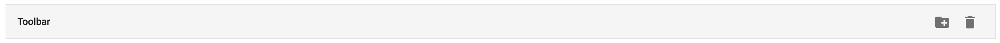
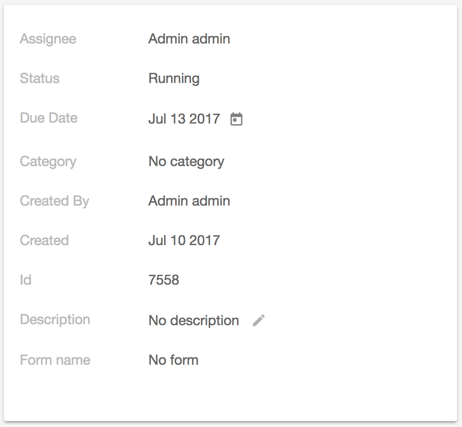

# Alfresco Core Library

<!-- markdown-toc start - Don't edit this section.  npm run toc to generate it-->

<!-- toc -->

- [Prerequisites](#prerequisites)
- [Install](#install)
- [Toolbar Component](#toolbar-component)
  * [Basic example](#basic-example)
- [Upload Directive](#upload-directive)
  * [Basic usage](#basic-usage)
  * [Modes](#modes)
    + [Click mode](#click-mode)
    + [Drop mode](#drop-mode)
  * [Events](#events)
  * [Styling](#styling)
- [Alfresco Api Service](#alfresco-api-service)
- [AppConfigService](#appconfigservice)
  * [Different configurations based on environment settings](#different-configurations-based-on-environment-settings)
  * [Variable substitution in configuration strings](#variable-substitution-in-configuration-strings)
  * [Unit testing](#unit-testing)
- [User Preferences Service](#user-preferences-service)
- [Notification Service](#notification-service)
- [Context Menu directive](#context-menu-directive)
- [Accordion Component](#accordion-component)
  * [Properties](#properties)
- [Authentication Service](#authentication-service)
  * [Events](#events-1)
- [ADF Card View](#adf-card-view)
  * [Properties](#properties-1)
  * [Editing](#editing)
  * [Defining properties](#defining-properties)
  * [Card Text Item](#card-text-item)
    + [Options](#options)
  * [Card Map Item](#card-map-item)
    + [Options](#options-1)
  * [Card Date Item](#card-date-item)
    + [Options](#options-2)
  * [Defining your custom card Item](#defining-your-custom-card-item)
    + [1. Define the model for the custom type](#1-define-the-model-for-the-custom-type)
    + [2. Define the component for the custom type](#2-define-the-component-for-the-custom-type)
    + [3. Add you custom component to your module's entryComponents list](#3-add-you-custom-component-to-your-modules-entrycomponents-list)
- [TranslationService](#translationservice)
  * [Registering translation sources](#registering-translation-sources)
  * [Switching languages](#switching-languages)
- [Renditions Service](#renditions-service)
- [Build from sources](#build-from-sources)
- [NPM scripts](#npm-scripts)
- [Demo](#demo)
- [License](#license)

<!-- tocstop -->

<!-- markdown-toc end -->

## Prerequisites

Before you start using this development framework, make sure you have installed all required software and done all the
necessary configuration, see this [page](https://github.com/Alfresco/alfresco-ng2-components/blob/master/PREREQUISITES.md).

> If you plan using this component with projects generated by Angular CLI, please refer to the following article: [Using ADF with Angular CLI](https://github.com/Alfresco/alfresco-ng2-components/wiki/Angular-CLI)

## Install

```sh
npm install ng2-alfresco-core
```

Available features

## Toolbar Component

<adf-toolbar> is an easy container for headers, titles, actions, breadcrumbs.

### Basic example

```html
<adf-toolbar title="Toolbar">
    <button md-icon-button>
        <md-icon>create_new_folder</md-icon>
    </button>
    <button md-icon-button>
        <md-icon>delete</md-icon>
    </button>
</adf-toolbar>
```

You should see result similar to the following one:

 

For more details about the [toolbar](src/components/toolbar/toolbar.md).

| Feature | Notes | Docs |
| --- | --- | --- |
| toolbar | toolbar component | [Docs](src/components/toolbar/toolbar.md) |
| node-permission | disable elements based on node permissions | [Docs](src/directives/node-permission.md)

## Upload Directive

Allows your components or common HTML elements reacting on File drag and drop in order to upload content.
Used by attaching to an element or component.

### Basic usage

The directive itself does not do any file management process,
but collects information on dropped files and raises corresponding events instead.

```html
<div style="width:100px; height:100px"
     [adf-upload]="true"
     [adf-upload-data]="{ some: 'data' }">
    Drop files here...
</div>
```

It is possible controlling when upload behaviour is enabled/disabled by binding directive to a `boolean` value or expression:

```html
<div [adf-upload]="true">...</div>
<div [adf-upload]="allowUpload">...</div>
<div [adf-upload]="isUploadEnabled()">...</div>
```

You can decorate any element including buttons, for example:

```html
<button [adf-upload]="true" [multiple]="true" [accept]="'image/*'">
    Upload photos
</button>
```

### Modes

Directive supports several modes:

- **drop** mode, where decorated element acts like a drop zone for files (**default** mode)
- **click** mode, where decorated element invokes File Dialog to select files or folders.

It is also possible combining modes together.

```html
<div [adf-upload]="true" mode="['click']">...</div>
<div [adf-upload]="true" mode="['drop']">...</div>
<div [adf-upload]="true" mode="['click', 'drop']">...</div>
```

#### Click mode

For the click mode you can provide additional attributes for the File Dialog:

- **directory**, enables directory selection
- **multiple**, enables multiple file/folder selection
- **accept**, filters the content accepted

```html
<div style="width: 50px; height: 50px; background-color: brown"
     [adf-upload]="true"
     [multiple]="true"
     [accept]="'image/*'">
</div>

<div style="width: 50px; height: 50px; background-color: blueviolet"
     [adf-upload]="true"
     [multiple]="true"
     [directory]="true">
</div>
```

#### Drop mode

For the moment upload directive supports only Files (single or multiple).
Support for Folders and `accept` filters is subject to implement.

### Events

Once a single or multiple files are dropped on the decorated element the `upload-files` [CustomEvent](https://developer.mozilla.org/en-US/docs/Web/API/CustomEvent) is raised.
The DOM event is configured to have `bubbling` enabled, so any component up the component tree can handle, process or prevent it:

```html
<div (upload-files)="onUploadFiles($event)">
    <div [adf-upload]="true"></div>
</div>
```

```ts
onUploadFiles(e: CustomEvent) {
    console.log(e.detail.files);

    // your code
}
```

Please note that event will be raised only if valid [Files](https://developer.mozilla.org/en-US/docs/Web/API/File) were dropped onto the decorated element.

The `upload-files` event is cancellable, so you can stop propagation of the drop event to upper levels in case it has been already handled by your code:

```ts
onUploadFiles(e: CustomEvent) {
    e.stopPropagation();
    e.preventDefault();

    // your code
}
```

It is also possible attaching arbitrary data to each event in order to access it from within external event handlers.
A typical scenario is data tables where you may want to handle also the data row and/or underlying data to be accessible upon files drop.

You may be using `adf-upload-data` to bind custom values or objects for every event raised:

```html
<div [adf-upload]="true" [adf-upload-data]="dataRow"></div>
<div [adf-upload]="true" [adf-upload-data]="'string value'"></div>
<div [adf-upload]="true" [adf-upload-data]="{ name: 'custom object' }"></div>
<div [adf-upload]="true" [adf-upload-data]="getUploadData()"></div>
```

As part of the `details` property of the [CustomEvent](https://developer.mozilla.org/en-US/docs/Web/API/CustomEvent) you can get access to the following:

```ts
detail: {
    sender: UploadDirective,    // directive that raised given event
    data: any,                  // arbitrary data associated (bound)
    files: File[]               // dropped files
}
```

### Styling

The decorated element gets `adf-upload__dragging` CSS class name in the class list every time files are dragged over it.
This allows changing look and feel of your components in case additional visual indication is required, 
for example you may want drawing a dashed border around the table row on drag:

```html
<table>
    <tr [adf-upload]="true">
        ...
    </tr>
</table>
```

```css
.adf-upload__dragging > td:first-child {
    border-left: 1px dashed rgb(68,138,255);
}

.adf-upload__dragging > td {
    border-top: 1px dashed rgb(68,138,255);
    border-bottom: 1px dashed rgb(68,138,255);
}

.adf-upload__dragging > td:last-child {
    border-right: 1px dashed rgb(68,138,255);
}
```

## Alfresco Api Service

Provides access to initialized **AlfrescoJSApi** instance.

```ts
export class MyComponent implements OnInit {

    constructor(private apiService: AlfrescoApiService) {   
    }

    ngOnInit() {
        let nodeId = 'some-node-id';
        let params = {};
        this.apiService.getInstance().nodes
            .getNodeChildren(nodeId, params)
            .then(result => console.log(result));
    }
}
```

**Note for developers**: _the TypeScript declaration files for Alfresco JS API
are still under development and some Alfresco APIs may not be accessed
via your favourite IDE's intellisense or TypeScript compiler. 
In case of any TypeScript type check errors you can still call any supported 
Alfresco JS api by casting the instance to `any` type like the following:_

```ts
let api: any = this.apiService.getInstance();
api.nodes.addNode('-root-', body, {});
```

## AppConfigService

The `AppConfigService` service provides support for loading and accessing global application configuration settings that you store on the server side in the form of a JSON file.

> You may need this service when deploying your ADF-based application to production servers. 
> There can be more than one server running web apps with different settings, like different addresses for Alfresco Content/Process services.
> Or there is a need to change global settings for all the clients.

The service is already pre-configured to look for the "app.config.json" file in the application root address.

That allows deploying ADF-based web applications to multiple servers together with different settings files, for example having development, staging or production environments.

Example of the default settings file content:

**app.config.json**

```json
{
    "ecmHost": "http://localhost:3000/ecm",
    "bpmHost": "http://localhost:3000/bpm",
    "application": {
        "name": "Alfresco"
    }
}
```

Please note that settings above are default ones coming with the server. 
You can override the values in your custom `app.config.json` file if needed. 

You can also change the path or name of the configuration file when importing the CoreModule in your main application.

```ts
...
@NgModule({
    imports: [
        ...
        CoreModule.forRoot({
            appConfigFile: 'app.production.config.json'
        })
    ],
    ...
}
export class AppModule { }
```

Below is a simple example of using the AppConfigService in practice. 

**app.component.ts**

```ts
import { AppConfigService } from 'ng2-alfresco-core';

@Component({...})
export class AppComponent {

    constructor(appConfig: AppConfigService) {

        // get nested properties by the path
        console.log(appConfig.get('application.name'));

        // use generics for type safety 
        let version: number = appConfig.get<number>('version');
        console.log(version);
    }
}
```

Your custom components can also benefit from the `AppConfigService`,
you can put an unlimited number of settings and optionally a nested JSON hierarchy.

### Different configurations based on environment settings

The CoreModule allows you to provide custom application configuration path.
That means you can evaluate the final file name based on conditions, for example environment settings:

```ts
let appConfigFile = 'app.config-dev.json';
if (process.env.ENV === 'production') {
    appConfigFile = 'app.config-prod.json';
}

@NgModule({
    imports: [
        ...
        CoreModule.forRoot({
            appConfigFile: appConfigFile
        }),
        ...
    ]
})
```

### Variable substitution in configuration strings

The `AppConfigService` also supports a limited set of variable substitutions to greatly simplify certain scenarios. 

```json
{
    "ecmHost": "http://{hostname}:{port}/ecm",
    "bpmHost": "http://{hostname}:{port}/bpm",
    "application": {
        "name": "Alfresco"
    }
}
```

The supported variables are:

| Variable name | Runtime value |
| --- | --- |
| hostname | `location.hostname` |
| port | `location.port` |

### Unit testing

You can also provide custom values for the entire service. 
This might become handy when creating unit tests.

```ts
describe('MyTest', () => {

    beforeEach(() => {
        TestBed.configureTestingModule({
            imports: [
                CoreModule.forRoot(),
                AppConfigModule.forRoot('app.config.json', {
                    ecmHost: 'http://localhost:9876/ecm'
                })
            ]
        });
    });

});
```

In the example above custom values are applied on the top of all the values the `AppConfigService` has previously loaded.
If there is an 'app.config.json' file loaded at unit test run time then your custom values will overwrite exiting values with the same keys if present. 

## User Preferences Service

The `UserPreferencesService` allows you to store preferences for the components.
The preferences are bound to a particular `prefix` so the application can switch between different profiles on demand.

For example upon login you can set the `prefix` as current username:

```ts
import { UserPreferencesService, AuthenticationService } from 'ng2-alfresco-core';

@Component({...})
class AppComponent {
    constructor(private userPreferences: UserPreferencesService,
                private authService: AuthenticationService) {
    }

    onLoggedIn() {
        this.userPreferences.setStoragePrefix(
            this.authService.getEcmUsername()
        );
    }
}
```

As soon as you assign the storage prefix all settings that you get or set via the `UserPreferencesService` will be saved to dedicated profile.

You can import the service in your controller and use its APIs like below:

```ts
@Component({...})
class AppComponent {
    constructor(userPreferences: UserPreferencesService) {

        userPreferences.set('myProperty1', 'value1');
        userPreferences.set('myProperty2', 'value2');

        console.log(
            userPreferences.get('myProperty1')
        );
    }
}
```

The service also provides quick access to a set of the "known" properties used across ADF components.

Known properties:

- paginationSize (number) - gets or sets the preferred pagination size

## Notification Service

The Notification Service is implemented on top of the Angular 2 Material Design snackbar.
Use this service to show a notification message, and optionally get feedback from it.

```ts
import { NotificationService } from 'ng2-alfresco-core';

export class MyComponent implements OnInit {

    constructor(private notificationService: NotificationService) {   
    }

    ngOnInit() {
          this.notificationService.openSnackMessage('test', 200000).afterDismissed().subscribe(() => {
                    console.log('The snack-bar was dismissed');
                });                        
    }
}
```

```ts
import { NotificationService } from 'ng2-alfresco-core';

export class MyComponent implements OnInit {

    constructor(private notificationService: NotificationService) {   
    }

    ngOnInit() {
         this.notificationService.openSnackMessageAction('Do you want to report this issue?', 'send', 200000).afterDismissed().subscribe(() => {
                console.log('The snack-bar was dismissed');
            });
    }
}
```

## Context Menu directive

_See **Demo Shell** or **DocumentList** implementation for more details and use cases._

```html
<my-component [context-menu]="menuItems"></my-component>
<context-menu-holder></context-menu-holder>
```

```ts
@Component({
    selector: 'my-component'
})
export class MyComponent implements OnInit {

    menuItems: any[];
    
    constructor() {
        this.menuItems = [
            { title: 'Item 1', subject: new Subject() },
            { title: 'Item 2', subject: new Subject() },
            { title: 'Item 3', subject: new Subject() }
        ];
    }
    
    ngOnInit() {
        this.menuItems.forEach(l => l.subject.subscribe(item => this.commandCallback(item)));
    }
    
    commandCallback(item) {
        alert(`Executing ${item.title} command.`);
    }

}
```

## Accordion Component

The component provides a way to easily create an accordion menu. You can customize the header and the icon.

```html
<adf-accordion>
    <adf-accordion-group [heading]="titleHeading" [isSelected]="true" [headingIcon]="'assignment'">
        <my-list></my-list>
    </adf-accordion-group>
</adf-accordion>
```

```ts
@Component({
    selector: 'my-component'
})
export class MyComponent implements OnInit {

    titleHeading: string;

    constructor() {
        this.titleHeading = 'My Group';
    }

}
```

### Properties

| Name | Type | Description |
| --- | --- | --- |
| heading | string | The header title. |
| isSelected | boolean | Define if the accordion group is selected or not. |
| headingIcon | string | The material design icon. |
| hasAccordionIcon | boolean | Define if the accordion (expand) icon needs to be shown or not, the default value is true |

## Authentication Service

The authentication service is used inside the [login component](../ng2-alfresco-login) and is possible to find there an example of how to use it.

### Events

| Name | Description |
| --- | --- |
| onLogin | Raised when user logs in |
| onLogout | Raised when user logs out |

**app.component.ts**

```ts
import { AuthenticationService } from 'ng2-alfresco-core';

@Component({...})
export class AppComponent {
    constructor(authService: AuthenticationService) {
        this.AuthenticationService.login('admin', 'admin').subscribe(
            token => {
                console.log(token);
            },
            error => {
                console.log(error);
            }
        );
    }
}
```

## ADF Card View

The CardViewComponent is a configurable property list renderer. You define the property list, the CardViewComponent does the rest. Each property represents a card view item (a row) in the card view component. At the time of writing two different kind of card view item (property type) is supported out of the box ([text](#card-text-item) item and [date](#card-date-item) item) but you can define your own custom types as well.

```html
<adf-card-view
    [properties]="[{label: 'My Label', value: 'My value'}]"
    [editable]="false">
</adf-card-view>

```



### Properties

| Name | Type | Description |
| --- | --- | --- |
| properties | [CardViewItem](#cardviewitem)[] | (**required**) The custom view to render |
| editable | boolean | If the component editable or not |

### Editing

The card view can optionally allow its properties to be edited. You can control the editing of the properties in two level.
- **global level** - *via the editable parameter of the card-view.component*
- **property level** -  *in each property via the editable attribute*

If you set the global editable parameter to false, no properties can be edited regardless of what is set inside the property.

### Defining properties

Properties is an array of models which one by one implements the CardViewItem interface.

```js
export interface CardViewItem {
    label: string;
    value: any;
    key: string;
    default?: any;
    type: string;
    displayValue: string;
    editable?: boolean;
}
```

At the moment three models are defined out of the box:

- **[CardViewTextItemModel](#card-text-item)** - *for text items*
- **[CardViewMapItemModel](#card-map-item)** - *for map items*
- **[CardViewDateItemModel](#card-date-item)** - *for date items*

Each of them are extending the abstract CardViewBaseItemModel class, and each of them are adding some custom functionality to the basic behaviour.

```js
 this.properties = [
    new CardViewTextItemModel({
        label: 'Name',
        value: 'Spock',
        key: 'name',
        default: 'default bar' ,
        multiline: false
    }),
    new CardViewMapItemModel({
        label: 'My map',
        value: new Map([['999', 'My Value']]),
        key: 'map',
        default: 'default map value' ,
        clickable: true
    }),
    new CardViewDateItemModel({
        label: 'Birth of date',
        value: someDate,
        key: 'birth-of-date',
        default: new Date(),
        format: '<any format that momentjs accepts>',
        editable: true
    }),
    ...
]
```

### Card Text Item

CardViewTextItemModel is a property type for text properties.

```js
const textItemProperty = new CardViewTextItemModel(options);
```

#### Options

| Name | Type | Default | Description |
| --- | --- | --- | --- |
| label* | string | --- | The label to render |
| value* | any | --- | The original value |
| key* | string | --- | the key of the property. Have an important role when editing the property. |
| default | any | --- | The default value to render in case the value is empty |
| displayValue* | string | --- | The value to render |
| editable | boolean | false | Whether the property editable or not |
| clickable | boolean | false | Whether the property clickable or not |
| multiline | string | false | Single or multiline text |

### Card Map Item

CardViewMapItemModel is a property type for map properties.

```js
const mapItemProperty = new CardViewMapItemModel(options);
```

#### Options

| Name | Type | Default | Description |
| --- | --- | --- | --- |
| label* | string | --- | The label to render |
| value* | Map | --- | A map that contains the key value pairs |
| key* | string | --- | the key of the property. Have an important role when editing the property. |
| default | any | --- | The default value to render in case the value is empty |
| displayValue* | string | --- | The value to render |
| clickable | boolean | false | Whether the property clickable or not |

### Card Date Item

CardViewDateItemModel is a property type for date properties.

```js
const dateItemProperty = new CardViewDateItemModel(options);
```

#### Options

| Name | Type | Default | Description |
| --- | --- | --- | --- |
| label* | string | --- | The label to render |
| value* | any | --- | The original value |
| key* | string | --- | the key of the property. Have an important role when editing the property. |
| default | any | --- | The default value to render in case the value is empty |
| displayValue* | string | --- | The value to render |
| editable | boolean | false | Whether the property editable or not |
| format | boolean | "MMM DD YYYY" | any format that momentjs accepts |

### Defining your custom card Item

Card item components are loaded dynamically, which makes you able to define your own custom component for the custom card item type.

Let's consider you want to have a **stardate** type to display Captain Picard's birthday (47457.1). For this, you need to do the following steps.

#### 1. Define the model for the custom type

Your model has to extend the CardViewBaseItemModel and implement the CardViewItem interface.
*(You can check how the CardViewTextItemModel is implemented for further guidance.)*

```js
export class CardViewStarDateItemModel extends CardViewBaseItemModel implements CardViewItem {
    type: string = 'star-date';

    get displayValue() {
        return this.convertToStarDate(this.value) || this.default;
    }

    private convertToStarDate(starTimeStamp: number): string {
        // Do the magic
    }
}
```

The most important part of this model is the value of the **type** attribute. This is how the Card View component will be able to recognise which component is needed to render it dynamically.

The type is a **hyphen-separated-lowercase-words** string (just like how I wrote it). This will be converted to a PascalCase (or UpperCamelCase) string to find the right component. In our case the Card View component will look for the CardView**StarDate**ItemComponent.

#### 2. Define the component for the custom type

As discussed in the previous step the only important thing here is the naming of your component class ( **CardViewStarDateItemComponent**). Since the selector is not used in this case, you can give any selector name to it, but it makes sense to follow the angular standards.

```js
@Component({
    selector: 'card-view-stardateitem' // For example
    ...
})
export class CardViewStarDateItemComponent {
    @Input()
    property: CardViewStarDateItemModel;

    @Input()
    editable: boolean;

    constructor(private cardViewUpdateService: CardViewUpdateService) {}

    isEditble() {
        return this.editable && this.property.editable;
    }

    showStarDatePicker() {
        ...
    }
}

```
To make your component editable, you can have a look on either the CardViewTextItemComponent' or on the CardViewDateItemComponent's source.

#### 3. Add you custom component to your module's entryComponents list

For Angular to be able to load your custom component dynamically, you have to register your component in your modules entryComponents.

```js
@NgModule({
    imports: [...],
    declarations: [
        CardViewStarDateItemComponent
    ],
    entryComponents: [
        CardViewStarDateItemComponent
    ],
    exports: [...]
})
export class MyModule {}
```

## TranslationService

### Registering translation sources

In order to enable localisation support you will need to create a `/resources/i18n/en.json` file
and register its parent `i18n` folder with your component or application module.

For example:

```ts
import { TRANSLATION_PROVIDER } from 'ng2-alfresco-core';

@NgModule({
    ...
    providers: [
        ...
        {
            provide: TRANSLATION_PROVIDER,
            multi: true,
            useValue: {
                name: 'ng2-alfresco-core',
                source: 'assets/ng2-alfresco-core'
            }
        }
    ]
})
```

Note: the `source` property points to the web application root, please ensure you have webpack settings to copy all the i18n files at compile time.

```text
index.html
assets/ng2-alfresco-core/i18n/en.json
...
```

You can register as many entries as you would like.

### Switching languages

Depending on your application, you may want to have buttons or dropdown menus to allow language selection for the end users.

You can use `TranslationService` to switch languages from your code based on input events of your choice:

```ts
class MyComponent {
    constructor(private translateService: TranslationService) {
    }

    onLanguageClicked(lang: string) {
        this.translateService.use(lang || 'en');
    }
}
```

## Renditions Service

* getRenditionsListByNodeId(nodeId: string)
* createRendition(nodeId: string, encoding: string)
* getRendition(nodeId: string, encoding: string)
* isRenditionAvailable(nodeId: string, encoding: string)

## Build from sources

You can build component from sources with the following commands:

```sh
npm install
npm run build
```

> The `build` task rebuilds all the code, runs tslint, license checks 
> and other quality check tools before performing unit testing.

## NPM scripts

| Command | Description |
| --- | --- |
| npm run build | Build component |
| npm run test | Run unit tests in the console |
| npm run test-browser | Run unit tests in the browser
| npm run coverage | Run unit tests and display code coverage report |

## Demo

Please check the demo folder for a demo project

```sh
cd demo
npm install
npm start
```

## License

[Apache Version 2.0](https://github.com/Alfresco/alfresco-ng2-components/blob/master/LICENSE)
