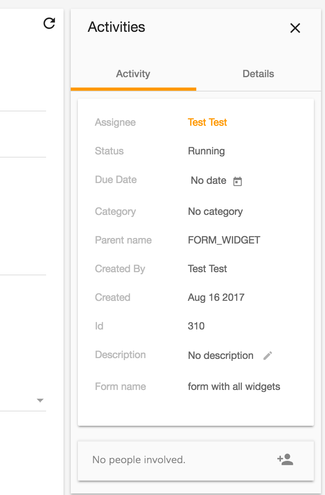
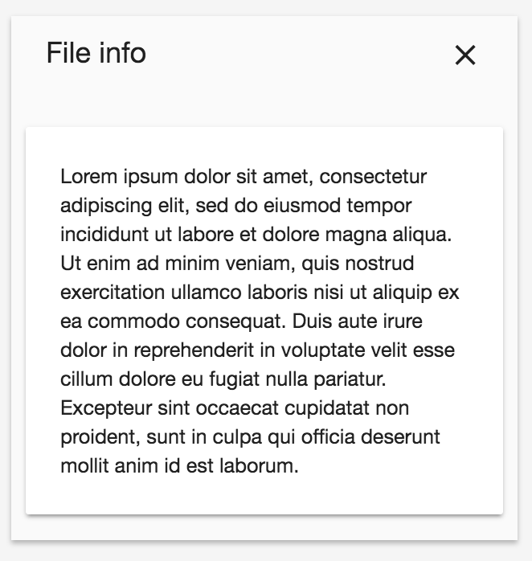

# Info Drawer component(s)

<!-- markdown-toc start - Don't edit this section.  npm run toc to generate it-->

<!-- toc -->

- [InfoDrawerLayoutComponent](#infodrawerlayoutcomponent)
  * [Example](#example)
- [InfoDrawerComponent](#infodrawercomponent)
  * [Properties](#properties)
  * [Example](#example-1)

<!-- tocstop -->

<!-- markdown-toc end -->

The **Info Drawer components** helps you manage your layout when you want a *(tabbable)* sidebar-like design, what you can see below.



There are 2 different kind of components what you can choose from:

- InfoDrawerLayoutComponent
- InfoDrawerComponent

## InfoDrawerLayoutComponent

The InfoDrawerLayoutComponent (as the name says) is basically just a layout with css applied on it. In this layout you have 3 regions you can transclude content into:

- info-drawer-title
- info-drawer-buttons
- info-drawer-content



### Example

```html
<adf-info-drawer-layout>
        <div info-drawer-title>File info</div>

        <div info-drawer-buttons>
            <md-icon>clear</md-icon>
        </div>

        <div info-drawer-content>
            <md-card>
                Lorem ipsum dolor sit amet...
            </md-card>
        </div>
</adf-info-drawer-layout>
```

## InfoDrawerComponent

The InfoDrawerComponent is on top of the InfoDrawerLayoutComponent. This version of the info drawer is supposed to be used if you need tabbing behaviour. Additionally you can set a title (if it only contains a string) with the **title** input property.
This component has the same 3 regions as described above, but if you want to leverage the tabbing functionality, you have to use the **adf-info-drawer-tab** component to organize your content. The only input paramter of the adf-info-drawer-tab component is the **"label"**, with you can specify the tab label with.

### Properties

| Name | Type | Default | Description |
| --- | --- | --- | --- |
| title | string | null | The title of the info drawer component|

### Example

```html
<adf-info-drawer title="Activities">
    <div info-drawer-buttons>
        <md-icon (click)="close()">clear</md-icon>
    </div>

    <adf-info-drawer-tab label="Activity">
        <mycomponent1></mycomponent1>
        <mycomponent2></mycomponent2>
    </adf-info-drawer-tab>

    <adf-info-drawer-tab label="Details">
        <mycomponent3></mycomponent3>
    </adf-info-drawer-tab>

</adf-info-drawer>
```