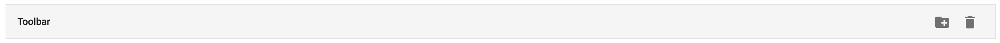
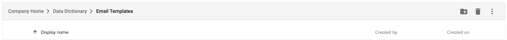
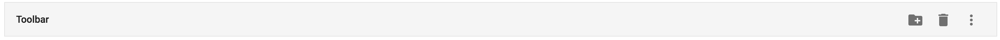
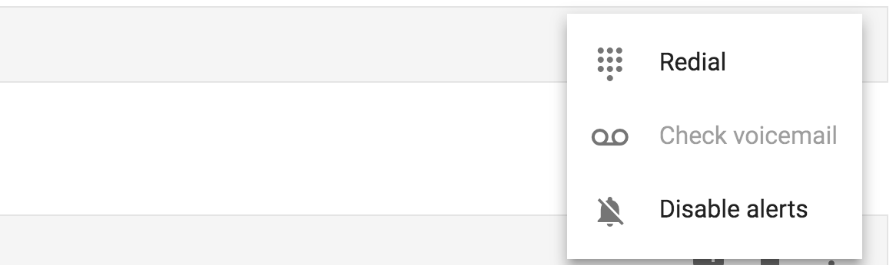
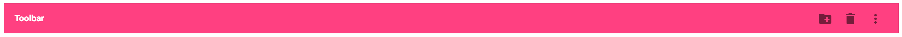

# Toolbar Component

## Basic example

```html
<adf-toolbar title="Toolbar">
    <button md-icon-button>
        <md-icon>create_new_folder</md-icon>
    </button>
    <button md-icon-button>
        <md-icon>delete</md-icon>
    </button>
</adf-toolbar>
```

You should see result similar to the following one:



## Properties

| Name | Type | Default | Description |
| --- | --- | --- | --- |
| title | string | | Toolbar title |
| color | string | | Toolbar color, can be changed to empty value (default), `primary`, `accent` or `warn`. |

## Custom title

You can use any HTML layout or Angular component as a content of the Title section by using the special `<adf-toolbar-title>` component instead of the "title" attribute:

```html
<adf-toolbar>
    <adf-toolbar-title>
        <adf-breadcrumb ...></adf-breadcrumb>
    </adf-toolbar-title>
    ...
</adf-toolbar>
```

The toolbar should now look similar to the following:



## Divider

You can divide groups of elements with a visual separator `<adf-toolbar-divider>`:

```html
<adf-toolbar>
    <button></button>
    <button></button>
    <adf-toolbar-divider></adf-toolbar-divider>
    <button></button>
</adf-toolbar>
```

## Dropdown menu

You can use the following example to create a dropdown menu:

```html
<adf-toolbar title="Toolbar">
    ...

    <button md-icon-button [mdMenuTriggerFor]="menu">
        <md-icon>more_vert</md-icon>
    </button>
    <md-menu #menu="mdMenu">
        <button md-menu-item>
            <md-icon>dialpad</md-icon>
            <span>Redial</span>
        </button>
        <button md-menu-item disabled>
            <md-icon>voicemail</md-icon>
            <span>Check voicemail</span>
        </button>
        <button md-menu-item>
            <md-icon>notifications_off</md-icon>
            <span>Disable alerts</span>
        </button>
    </md-menu>
</adf-toolbar>
```

The code above is based on the `<md-menu>` component from the `@angular/material` library. You can use any custom menu component as well.



Once you click the menu button you should see the following menu items as defined earlier:



## Custom color

Besides the default color you can use 'primary', 'accent', or 'warn' values:

Depending on the overall application theme the colors of the toolbar should change.

For example:




