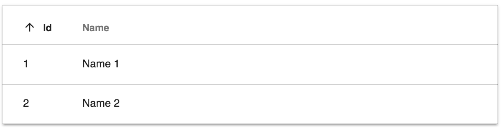
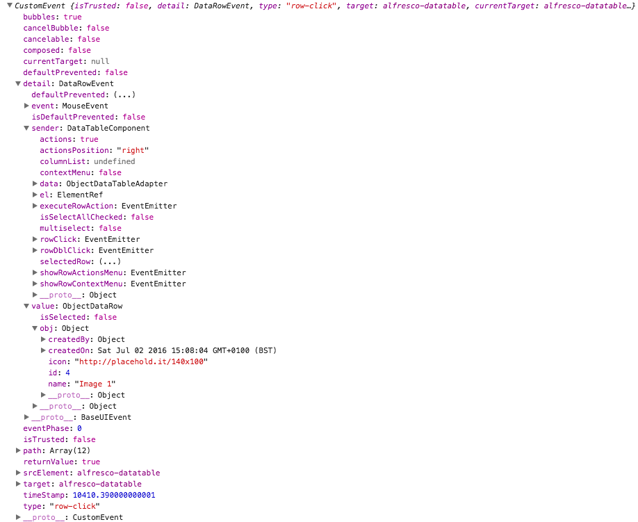
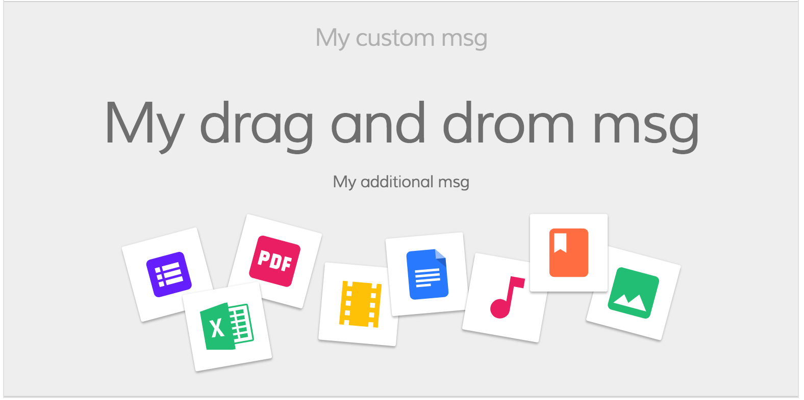
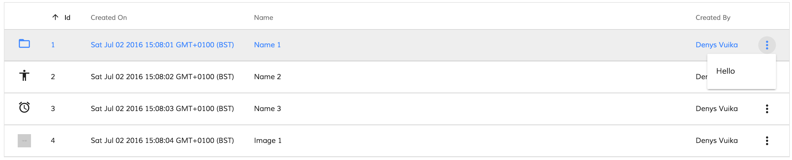
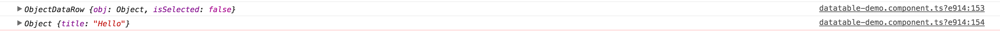
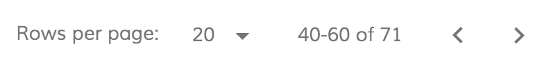

# DataTable Component

<!-- markdown-toc start - Don't edit this section.  npm run toc to generate it-->

<!-- toc -->

- [Prerequisites](#prerequisites)
- [Install](#install)
- [Basic usage](#basic-usage)
  * [DataTable Properties](#datatable-properties)
  * [DataColumn Properties](#datacolumn-properties)
  * [DataTable Events](#datatable-events)
  * [DataTable DOM Events](#datatable-dom-events)
  * [Automatic column header translation](#automatic-column-header-translation)
  * [Custom tooltips](#custom-tooltips)
  * [Custom Empty content template](#custom-empty-content-template)
  * [Custom Empty content template](#custom-empty-content-template-1)
  * [Loading content template](#loading-content-template)
  * [Column Templates](#column-templates)
  * [Events](#events)
    + [rowClick event](#rowclick-event)
    + [rowDblClick event](#rowdblclick-event)
    + [showRowContextMenu event](#showrowcontextmenu-event)
    + [showRowActionsMenu event](#showrowactionsmenu-event)
    + [executeRowAction event](#executerowaction-event)
- [Data sources](#data-sources)
- [Generate schema](#generate-schema)
- [Pagination Component](#pagination-component)
  * [Properties](#properties)
  * [Events](#events-1)
- [Build from sources](#build-from-sources)
- [NPM scripts](#npm-scripts)
- [Demo](#demo)
- [License](#license)

<!-- tocstop -->

<!-- markdown-toc end -->

See it live: [DataTable Quickstart](https://embed.plnkr.co/80qr4YFBeHjLMdAV0F6l/)

## Prerequisites

Before you start using this development framework, make sure you have installed all required software and done all the
necessary configuration, see this [page](https://github.com/Alfresco/alfresco-ng2-components/blob/master/PREREQUISITES.md).

> If you plan using this component with projects generated by Angular CLI, please refer to the following article: [Using ADF with Angular CLI](https://github.com/Alfresco/alfresco-ng2-components/wiki/Angular-CLI)

## Install

```sh
npm install ng2-alfresco-datatable
```

## Basic usage

**app.component.html**

```html
<adf-datatable 
    [data]="data">
</adf-datatable>
```

**app.component.ts**

```ts
import { ObjectDataTableAdapter }  from 'ng2-alfresco-datatable';

@Component({...})
export class DataTableDemo {
    data: ObjectDataTableAdapter;

    constructor() {
        this.data = new ObjectDataTableAdapter(
            // data
            [
                {id: 1, name: 'Name 1'},
                {id: 2, name: 'Name 2'}
            ],
            // schema
            [
                {
                    type: 'text',
                    key: 'id',
                    title: 'Id',
                    sortable: true
                },
                {
                    type: 'text',
                    key: 'name',
                    title: 'Name',
                    cssClass: 'full-width',
                    sortable: true
                }
            ]
        );
    }
}
```



You can also use HTML-based schema declaration like shown below:

```html
<adf-datatable [data]="data">
    <data-columns>
        <data-column key="icon" type="image" [sortable]="false"></data-column>
        <data-column key="id" title="Id"></data-column>
        <data-column key="createdOn" title="Created"></data-column>
        <data-column key="name" title="Name" class="full-width name-column"></data-column>
        <data-column key="createdBy.name" title="Created By"></data-column>
    </data-columns>
</adf-datatable>
```

```ts
import { ObjectDataTableAdapter } from 'ng2-alfresco-datatable';

@Component({...})
export class DataTableDemo {
    data: ObjectDataTableAdapter;

    constructor() {
        this.data = new ObjectDataTableAdapter(
            // data
            [
                {
                    id: 1, 
                    name: 'Name 1', 
                    createdBy : { name: 'user'}, 
                    createdOn: 123, 
                    icon: 'http://example.com/img.png'
                },
                {
                    id: 2, 
                    name: 'Name 2', 
                    createdBy : { name: 'user 2'}, 
                    createdOn: 123, 
                    icon: 'http://example.com/img.png'
                }
            ]
        );
    }
}
```

### DataTable Properties

| Name | Type | Default | Description |
| --- | --- | --- | --- |
| selectionMode | string | 'single' | Row selection mode. Can be none, `single` or `multiple`. For `multiple` mode you can use Cmd (macOS) or Ctrl (Win) modifier key to toggle selection for multiple rows.  |
| rowStyle | string | | The inline style to apply to every row, see [NgStyle](https://angular.io/docs/ts/latest/api/common/index/NgStyle-directive.html) docs for more details and usage examples |
| rowStyleClass | string | | The CSS class to apply to every row |
| data | DataTableAdapter | instance of **ObjectDataTableAdapter** | data source |
| rows | Object[] | [] | The rows that the datatable should show |
| multiselect | boolean | false | Toggles multiple row selection, renders checkboxes at the beginning of each row |
| actions | boolean | false | Toggles data actions column |
| actionsPosition | string (left\|right) | right | Position of the actions dropdown menu. | 
| fallbackThumbnail | string |  | Fallback image for row where thumbnail is missing|
| contextMenu | boolean | false | Toggles custom context menu for the component |
| allowDropFiles | boolean | false | Toggle file drop support for rows (see **ng2-alfresco-core/UploadDirective** for more details) |
| loading | boolean | false | Flag that indicates if the datatable is in loading state and needs to show the loading template. Read the documentation above to see how to configure a loading template  |
| showHeader | boolean | true | Toggles header visibility |
| selection | DataRow[] | [] | Contains selected rows |

### DataColumn Properties

Here's the list of available properties you can define for a Data Column definition.

| Name | Type | Default | Description |
| --- | --- | --- | --- |
| key | string | | Data source key, can be either column/property key like `title` or property path like `createdBy.name` |
| type | string (text\|image\|date) | text | Value type |
| format | string | | Value format (if supported by components), for example format of the date |
| sortable | boolean | true | Toggles ability to sort by this column, for example by clicking the column header |
| title | string | | Display title of the column, typically used for column headers. You can use the i18n resouce key to get it translated automatically. |
| template | `TemplateRef` | | Custom column template |
| sr-title | string | | Screen reader title, used for accessibility purposes |
| class | string | | Additional CSS class to be applied to column (header and cells) |
| formatTooltip | Function | | Custom tooltip formatter function. |

### DataTable Events

| Name | Description
| --- | --- |
| [rowClick](#rowclick-event) | Emitted when user clicks the row |
| [rowDblClick](#rowdblclick-event) | Emitted when user double-clicks the row |
| [showRowContextMenu](#showrowcontextmenu-event) | Emitted before context menu is displayed for a row |
| [showRowActionsMenu](#showrowactionsmenu-event) | Emitted before actions menu is displayed for a row |
| [executeRowAction](#executerowaction-event) | Emitted when row action is executed by user |

### DataTable DOM Events

Below are the DOM events raised by DataTable component.
These events bubble up the component tree and can be handled by any parent component.

| Name | Description |
| --- | --- |
| row-click | Raised when user clicks a row |
| row-dblclick | Raised when user double-clicks a row |
| row-select | Raised after user selects a row |
| row-unselect | Raised after user unselects a row |

For example:

```html
<root-component (row-click)="onRowClick($event)">
    <child-component>
        <adf-datatable></adf-datatable>
    </child-component>
</root-component>
```

```ts
onRowClick(event) {
    console.log(event);
}
```



### Automatic column header translation

You can also use i18n resource keys with DataColumn `title` property.
The component will automatically check the corresponding i18n resources and fetch corresponding value.

```html
<data-column
    key="name"
    title="MY.RESOURCE.KEY">
</data-column>
```

This feature is optional. Regular text either plain or converted via the `translate` pipe will still be working as it was before.

### Custom tooltips

You can create custom tooltips for the table cells by providing a `formatTooltip` property with a tooltip formatter function when declaring a data column.

```html
<data-column
    title="Name"
    key="name"
    [formatTooltip]="getNodeNameTooltip"
    class="full-width ellipsis-cell">
</data-column>
```

And the code in this case will be similar to the following:

```ts
import { DataColumn, DataRow } from 'ng2-alfresco-datatable';

@Component({...})
export class MyComponent {
    ...

    getNodeNameTooltip(row: DataRow, col: DataColumn): string {
        if (row) {
            return row.getValue('name');
        }
        return null;
    }
}
```

To disable the tooltip your function can return `null` or an empty string.

### Custom Empty content template

You can add a template that will be shown when there are no results in your datatable:

```html
<adf-datatable
    [data]="data"
    [actions]="contentActions"
    [multiselect]="multiselect"
    (showRowContextMenu)="onShowRowContextMenu($event)"
    (showRowActionsMenu)="onShowRowActionsMenu($event)"
    (executeRowAction)="onExecuteRowAction($event)"
    (rowClick)="onRowClick($event)"
    (rowDblClick)="onRowDblClick($event)">
    
    
        <no-content-template>
            <!--Add your custom empty template here-->
            <ng-template>
                <h1>Sorry, no content</h1>
            </ng-template>
        </no-content-template>
        
</adf-datatable>
```

### Custom Empty content template

You can use the empty list component if you want to show the default ADF empty template:

You can use any HTML layout or Angular component as a content of the empty template section by using the special `<adf-empty-list-header>, <adf-empty-list-body>, <adf-empty-list-footer>` elements:

```html
<adf-datatable
    [data]="data"
    [actions]="contentActions"
    [multiselect]="multiselect"
    (showRowContextMenu)="onShowRowContextMenu($event)"
    (showRowActionsMenu)="onShowRowActionsMenu($event)"
    (executeRowAction)="onExecuteRowAction($event)"
    (rowClick)="onRowClick($event)"
    (rowDblClick)="onRowDblClick($event)">
        
        <adf-empty-list>
            <adf-empty-list-header>"'My custom Header'"</adf-empty-list-header>
            <adf-empty-list-body>"'My custom body'"</adf-empty-list-body>
            <adf-empty-list-footer>"'My custom footer'"</adf-empty-list-footer>
            <ng-content>"'HTML Layout'"</ng-content>
        </adf-empty-list>
        
</adf-datatable>
```

| Name | Type | Default | Description
| --- | --- | --- | --- |
| emptyListImageUrl | String | empty_doc_lib.svg | The default image used as background |
| emptyMsg | String | This list is empty | The default title message |
| dragDropMsg | String | Drag and drop | The default drag and drop message |
| additionalMsg | String | Drag and drop | The default additional message |



### Loading content template

You can add a template that will be shown during the loading of your data:

```html
<adf-datatable
    [data]="data"
    [actions]="contentActions"
    [multiselect]="multiselect"
    [loading]=isLoading()"
    (showRowContextMenu)="onShowRowContextMenu($event)"
    (showRowActionsMenu)="onShowRowActionsMenu($event)"
    (executeRowAction)="onExecuteRowAction($event)"
    (rowClick)="onRowClick($event)"
    (rowDblClick)="onRowDblClick($event)">
    
        <loading-content-template>
            <ng-template>
               <!--Add your custom loading template here-->
                <md-progress-spinner
                    class="adf-document-list-loading-margin"
                    [color]="'primary'"
                    [mode]="'indeterminate'">
                </md-progress-spinner>
            </ng-template>
        </loading-content-template>
        
</adf-datatable>
```

```js
    isLoading(): boolean {
        //your custom logic to identify if you are in a loading state 
    }
```

Note: the `<loading-content-template>` and `<no-content-template>` can be used together

### Column Templates

It is possible to assign a custom column template like the following:

```html
<adf-datatable ...>
    <data-columns>
        <data-column title="Version" key="properties.cm:versionLabel">
            <template let-value="value">
                <span>V. {{value}}</span>
            </template>
        </data-column>
    </data-columns>
</adf-datatable>
```

Example above shows access to the underlying cell value by binding `value` property to the underlying context `value`:

```html
<template let-value="value">
```

Alternatively you can get access to the entire data context using the following syntax:

```html
<template let-entry="$implicit">
```

That means you are going to create local variable `entry` that is bound to the data context via Angular's special `$implicit` keyword.

```html
<template let-entry="$implicit">
    <span>V. {{entry.data.getValue(entry.row, entry.col)}}</span>
</template>
```

In the second case `entry` variable is holding a reference to the following data context:

```ts
{
    data: DataTableAdapter,
    row: DataRow,
    col: DataColumn
}
```

### Events

#### rowClick event

_This event is emitted when user clicks the row._

Event properties:

```ts
sender: any     // DataTable instance 
value: DataRow, // row clicked
event: Event    // original HTML DOM event
```

Handler example:

```ts
onRowClicked(event: DataRowEvent) {
    console.log(event.value);
}
```

_This event is cancellable, you can use `event.preventDefault()` to prevent default behaviour._

#### rowDblClick event

_This event is emitted when user double-clicks the row._

Event properties:

```ts
sender: any     // DataTable instance 
value: DataRow, // row clicked
event: Event    // original HTML DOM event
```

Handler example:

```ts
onRowDblClicked(event: DataRowEvent) {
    console.log(event.value);
}
```

_This event is cancellable, you can use `event.preventDefault()` to prevent default behaviour._

#### showRowContextMenu event

_Emitted before context menu is displayed for a row._ 

Note that DataTable itself does not populate context menu items,
you can provide all necessary content via handler.

Event properties:

```ts
value: {
    row: DataRow,
    col: DataColumn,
    actions: []
}
```

Handler example:

```ts
onShowRowContextMenu(event: DataCellEvent) {
    event.value.actions = [
        { ... },
        { ... }
    ]
}
```

_This event is cancellable, you can use `event.preventDefault()` to prevent default behaviour._

DataTable will automatically render provided menu items.

_Please refer to [ContextMenu](https://www.npmjs.com/package/ng2-alfresco-core) 
documentation for more details on context actions format and behaviour._

#### showRowActionsMenu event

_Emitted before actions menu is displayed for a row.
Requires `actions` property to be set to `true`._

Event properties:

```ts
value: {
    row: DataRow,
    action: any
}
```

Note that DataTable itself does not populate action menu items,
you can provide all necessary content via handler.

_This event is cancellable, you can use `event.preventDefault()` to prevent default behaviour._

#### executeRowAction event

_Emitted when row action is executed by user._

Usually accompanies `showRowActionsMenu` event. 
DataTable itself does not execute actions but provides support for external
integration. If there were actions provided with `showRowActionsMenu` event
then `executeRowAction` will be automatically executed when user clicks 
corresponding menu item.

```html
<adf-datatable
    [data]="data"
    [multiselect]="multiselect"
    [actions]="true"
    (showRowActionsMenu)="onShowRowActionsMenu($event)"
    (executeRowAction)="onExecuteRowAction($event)">
</adf-datatable>
```

```ts
import { DataCellEvent, DataRowActionEvent } from 'ng2-alfresco-datatable';

onShowRowActionsMenu(event: DataCellEvent) {
    let myAction = {
        title: 'Hello'
        // your custom metadata needed for onExecuteRowAction
    };
    event.value.actions = [
        myAction
    ];
}

onExecuteRowAction(event: DataRowActionEvent) {
    let args = event.value;
    console.log(args.row);
    console.log(args.action);
    window.alert(`My custom action: ${args.action.title}`);
}
```





Developers are allowed to use any payloads as row actions.
The only requirement for the objects is having `title` property.

Once corresponding action is clicked in the dropdown menu DataTable invokes `executeRowAction` event
where you can handle the process, inspect the action payload and all custom properties defined earlier,
and do corresponding actions.

## Data sources

DataTable component gets data by means of data adapter. 
It is possible having data retrieved from different kinds of sources by implementing
a custom `DataTableAdapter` using the following interfaces:

```ts
interface DataTableAdapter {
    selectedRow: DataRow;
    getRows(): Array<DataRow>;
    setRows(rows: Array<DataRow>): void;
    getColumns(): Array<DataColumn>;
    setColumns(columns: Array<DataColumn>): void;
    getValue(row: DataRow, col: DataColumn): any;
    getSorting(): DataSorting;
    setSorting(sorting: DataSorting): void;
    sort(key?: string, direction?: string): void;
}

interface DataRow {
     isSelected: boolean;
     isDropTarget?: boolean;
     hasValue(key: string): boolean;
     getValue(key: string): any;
     cssClass?: string;
}

interface DataColumn {
    key: string;
    type: string; // text|image|date
    format?: string;
    sortable?: boolean;
    title?: string;
    srTitle?: string;
    cssClass?: string;
    template?: TemplateRef<any>;
}
```

DataTable provides [ObjectDataTableAdapter](https://github.com/Alfresco/alfresco-ng2-components/blob/master/ng2-components/ng2-alfresco-datatable/src/data/object-datatable-adapter.ts) out-of-the-box. 
This is a simple data adapter implementation that binds to object arrays 
and turns object fields into columns:

```ts
let data = new ObjectDataTableAdapter(
    // data
    [
        { id: 1, name: 'Name 1' },
        { id: 2, name: 'Name 2' }
    ],
    // schema
    [
        { 
            type: 'text', 
            key: 'id', 
            title: 'Id', 
            sortable: true 
        },
        {
            type: 'text', 
            key: 'name', 
            title: 'Name', 
            sortable: true
        }
    ]
);
```

## Generate schema 

It is possible to auto generate your schema if you have only the data row  

```ts
let data =  [
    { id: 2, name: 'abs' },
    { id: 1, name: 'xyz' }
];

let schema = ObjectDataTableAdapter.generateSchema(data);

/*Auto generated schema value:
[
    { 
        type: 'text', 
        key: 'id', 
        title: 'Id', 
        sortable: false 
    },
    {
        type: 'text', 
        key: 'name', 
        title: 'Name', 
        sortable: false
    }
] 
*/

```

## Pagination Component

The pagination object is a generic component to paginate component. The Alfresco API are paginated and return a Pagination object. You can use the pagination object to feed the pagination component and then listen to the event which returns the current pagination and query again the API with the options chosen by the user.



### Properties

| Name | Type | Default | Description
| --- | --- | --- | --- |
| supportedPageSizes | numer[] | [5, 10, 20, 50, 100] | This array describes the set of options shown in the pick list |
| maxItems | boolean | false | Max number of elements shown per page. If you pick another size from the pick list this option will be overwritten |
| pagination | Pagination | {count: 0, totalItems: 0, skipCount: 0, maxItems: 20 , hasMoreItems: true} | The Alfresco Api returns a pagination object, you can use it to feed the pagination component, or create your own. |

### Events

| Name | Description
| --- | --- |
| changePageSize | Emitted when user picks one of the options from the pick list |
| nextPage | Emitted when user clicks next page button |
| prevPage | Emitted when user clicks previous page button |

All the events carry with them the current pagination object.

## Build from sources

You can build component from sources with the following commands:

```sh
npm install
npm run build
```

> The `build` task rebuilds all the code, runs tslint, license checks 
> and other quality check tools before performing unit testing.

## NPM scripts

| Command | Description |
| --- | --- |
| npm run build | Build component |
| npm run test | Run unit tests in the console |
| npm run test-browser | Run unit tests in the browser
| npm run coverage | Run unit tests and display code coverage report |

## Demo

Please check the demo folder for a demo project

```sh
cd demo
npm install
npm start
```

## License

[Apache Version 2.0](https://github.com/Alfresco/alfresco-ng2-components/blob/master/LICENSE)
