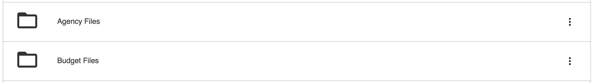
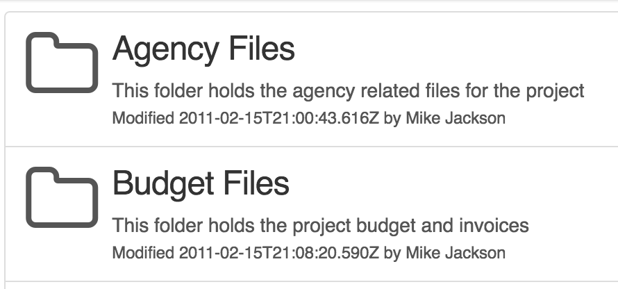
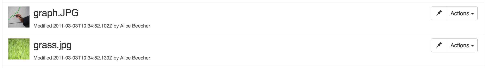
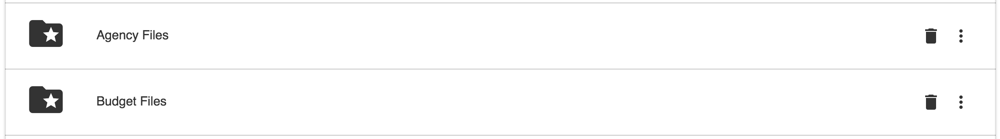
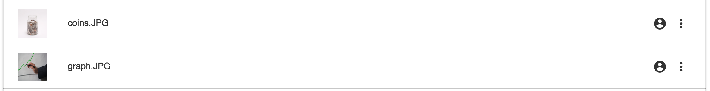
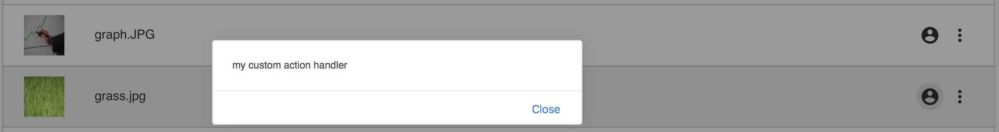

# Document List Component for Angular 2

## Install

```sh
npm install --save <TBD>
```

## Build from sources

Alternatively you can build component from sources with the following commands:

```sh
npm install
npm run build
```

## Basic usage

```html
<alfresco-document-list
    #list
    [thumbnails]="thumbnails"
    [breadcrumb]="breadcrumb"
    [navigate]="navigation"
    [downloads]="downloads"
    (itemClick)="onItemClick($event)">
</alfresco-document-list>
```

Example of the component that declares document list and provides values for bindings:

```ts
import {Component} from 'angular2/core';
import {
    DOCUMENT_LIST_DIRECTIVES,
    DOCUMENT_LIST_PROVIDERS
} from 'ng2-alfresco-documentlist/ng2-alfresco-documentlist';

@Component({
    selector: 'my-view',
    template: '<YOUR TEMPLATE>',
    directives: [DOCUMENT_LIST_DIRECTIVES],
    providers: [DOCUMENT_LIST_PROVIDERS]
})
export class MyView {
    thumbnails: boolean = true;
    breadcrumb: boolean = false;
    navigation: boolean = true;
    downloads: boolean = true;

    events: any[] = [];

    onItemClick($event) {
        console.log($event.value);
        this.events.push({
            name: 'Item Clicked',
            value: $event.value
        });
    }
}
```

Note the use of ```DOCUMENT_LIST_DIRECTIVES``` barrel that consolidates all the document list related directives together.
It gives you access to ```<document-actions>```, ```<folder-actions>``` and many other directives.
In addition ```DOCUMENT_LIST_PROVIDERS``` exports all primary services and providers needed for component to function.

### Custom folder icon

Document list element exposes `folder-icon` property that accepts a CSS class list value with
[folder_open](https://design.google.com/icons/#ic_folder_open) by default.



You can provide any list of classes in order to customize look and feel of the icon.
Example below shows the use of [folder_special](https://design.google.com/icons/#ic_folder_special) icon instead of the default one:

```html
<alfresco-document-list folder-icon="folder_special" ...>
</alfresco-document-list>
```



### Actions

Document List supports declarative actions for Documents and Folders.
Each action can be bound to either default out-of-box handler or a custom behavior.
You can define both folder and document actions at the same time.

#### Document actions

```html
<alfresco-document-list ...>
    <document-actions>
        <document-action title="System action" handler="system2"></document-action>
        <document-action title="Custom action" (execute)="myCustomAction1($event)"></document-action>
    </document-actions>
</alfresco-document-list>
```

```ts
export class MyView {
    // ...

    myCustomAction1(event) {
        alert('Custom document action for ' + event.value.displayName);
    }
}
```

All document actions are rendered as a dropdown menu as on the picture below:


#### Default action handlers

The following action handlers are provided out-of-box:

- Download

All system handler names are case-insensitive, `handler="download"` and `handler="DOWNLOAD"`
will trigger the same `download` action.

##### Download

Initiates download of the corresponding document file.

```html
<alfresco-document-list ...>
    <document-actions>
        <document-action title="Download" handler="download"></document-action>
    </document-actions>
</alfresco-document-list>
```


#### Quick document actions

It is also possible to display most frequent actions within a separate `<quick-documents>`
buttons panel:

```html
<alfresco-document-list ...>
    <quick-document-actions>
        <quick-document-action icon="extension" handler="system1"></quick-document-action>
        <quick-document-action icon="thumb_up" handler="system2"></quick-document-action>
    </quick-document-actions>
</alfresco-document-list>
```

Quick actions provide same support for system and custom handlers.
In addition it is possible setting button icon (css class list), text of the label or both.



#### Folder actions

```html
<alfresco-document-list ...>
    <folder-actions>
        <folder-action title="Default folder action 1" handler="system1"></folder-action>
        <folder-action title="Custom folder action" (execute)="myFolderAction1($event)"></folder-action>
    </folder-actions>
</alfresco-document-list>
```

```ts
export class MyView {
    // ...

    myFolderAction1(event) {
        alert('Custom folder action for ' + event.value.displayName);
    }
}
```


#### Quick folder actions

Quick folder actions have the same behavior as quick document actions.
You can use custom or system handler, provide icon and title.
Every folder action is rendered as a separate button.

```html
<alfresco-document-list ...>
    <quick-folder-actions>
        <quick-folder-action icon="delete" title="Delete" handler="system1"></quick-folder-action>
    </quick-folder-actions>
</alfresco-document-list>
```



#### Using all actions at the same time

```html
<alfresco-document-list #list
    [thumbnails]="thumbnails"
    [breadcrumb]="breadcrumb"
    [navigate]="navigation"
    [downloads]="downloads"
    (itemClick)="onItemClick($event)">
    <quick-folder-actions>
        <quick-folder-action title="Delete" handler="system1"></quick-folder-action>
    </quick-folder-actions>
    <folder-actions>
        <folder-action title="Default folder action 1" handler="system1"></folder-action>
        <folder-action title="Custom folder action" (execute)="myFolderAction1($event)"></folder-action>
    </folder-actions>
    <quick-document-actions>
        <quick-document-action icon="glyphicon glyphicon-pushpin" handler="system1"></quick-document-action>
    </quick-document-actions>
    <document-actions>
        <document-action title="System action" handler="system2"></document-action>
        <document-action title="Custom action" (execute)="myCustomAction1($event)"></document-action>
    </document-actions>
</alfresco-document-list>
```

## Advanced usage and customization

### Customizing default actions

It is possible extending or replacing the list of available system actions for documents and folders.
Actions for the documents and folders can be accessed via the following services:

- `DocumentActionsService`, document action menu and quick document actions
- `FolderActionsService`, folder action menu and quick folder actions

Example below demonstrates how a new action handler can be registered with the
`DocumentActionsService`.

```html
<alfresco-document-list ...>
    <quick-document-actions>
        <quick-document-action icon="account_circle" handler="my-handler"></quick-document-action>
    </quick-document-actions>
</alfresco-document-list>
```

You register custom handler called `my-handler` that will be executing `myDocumentActionHandler`
function each time upon being invoked.

```ts
import {
    DocumentActionsService
} from 'ng2-alfresco-documentlist/ng2-alfresco-documentlist';

export class MyView {

    constructor(documentActions: DocumentActionsService) {
        documentActions.setHandler(
            'my-handler',
            this.myDocumentActionHandler.bind(this)
        );
    }

    myDocumentActionHandler(obj: any) {
        window.alert('my custom action handler');
    }
}
```



Upon execution users will see the following dialog:



The same approach allows changing the way out-of-box action handlers behave.
Registering custom action with the name `download` replaces default one:

```ts
export class MyView {

    constructor(documentActions: DocumentActionsService) {
        documentActions.setHandler(
            'download',
            this.customDownloadBehavior.bind(this)
        );
    }

    customDownloadBehavior(obj: any) {
        window.alert('my custom download behavior');
    }
}
```

Typically you may want populating all your custom actions at the application root level or
by means of custom application service.
