# DocumentList Component

<!-- markdown-toc start - Don't edit this section.  npm run toc to generate it-->

<!-- toc -->

- [Prerequisites](#prerequisites)
- [See also](#see-also)
- [Install](#install)
- [Document List](#document-list)
  * [Properties](#properties)
  * [Events](#events)
  * [DOM Events](#dom-events)
  * [Handling DOM events](#handling-dom-events)
  * [Setting default folder](#setting-default-folder)
- [Custom icons for selected rows](#custom-icons-for-selected-rows)
- [Calling DocumentList api directly](#calling-documentlist-api-directly)
- [Breadcrumb Component](#breadcrumb-component)
  * [Properties](#properties-1)
  * [Events](#events-1)
- [Dropdown Site Component](#dropdown-site-component)
  * [Events](#events-2)
- [Menu Actions](#menu-actions)
- [Custom columns](#custom-columns)
  * [DataColumn Properties](#datacolumn-properties)
- [Column definition](#column-definition)
  * [Column Template](#column-template)
  * [Actions](#actions)
    + [Menu actions](#menu-actions)
    + [Default action handlers](#default-action-handlers)
      - [Delete - System handler combined with custom handler](#delete---system-handler-combined-with-custom-handler)
      - [Delete - Show notification message with no permission](#delete---show-notification-message-with-no-permission)
      - [Delete - Disable button checking the permission](#delete---disable-button-checking-the-permission)
      - [Download](#download)
      - [Copy and move](#copy-and-move)
    + [Folder actions](#folder-actions)
  * [Context Menu](#context-menu)
  * [Navigation mode](#navigation-mode)
  * [Events](#events-3)
- [Advanced usage and customization](#advanced-usage-and-customization)
  * [Custom row filter](#custom-row-filter)
  * [Custom image resolver](#custom-image-resolver)
  * [Hiding columns on small screens](#hiding-columns-on-small-screens)
  * [Custom row permissions style](#custom-row-permissions-style)
    + [Examples](#examples)
  * [Custom 'empty folder' template](#custom-empty-folder-template)
  * [Customizing default actions](#customizing-default-actions)
- [Build from sources](#build-from-sources)
- [NPM scripts](#npm-scripts)
- [Demo](#demo)
- [License](#license)

<!-- tocstop -->

<!-- markdown-toc end -->

## Prerequisites

Before you start using this development framework, make sure you have installed all required software and done all the
necessary configuration [prerequisites](https://github.com/Alfresco/alfresco-ng2-components/blob/master/PREREQUISITES.md).

> If you plan using this component with projects generated by Angular CLI, please refer to the following article: [Using ADF with Angular CLI](https://github.com/Alfresco/alfresco-ng2-components/wiki/Angular-CLI)

## See also

- [Walkthrough: adding indicators to clearly highlight information about a node](docs/metadata-indicators.md)

## Install

```sh
npm install ng2-alfresco-documentlist
```

## Document List

```html
<adf-document-list
    #documentList
    [currentFolderId]="'-my-'"
    [contextMenuActions]="true"
    [contentActions]="true"
    [creationMenuActions]="true">
</adf-document-list>
```

### Properties

The properties currentFolderId, folderNode and node are the entry initialization properties of the document list. They cannot be used together, choose the one that suites more your use case.

| Name | Type | Default | Description |
| --- | --- | --- | --- |
| selectionMode | string | 'single' | Row selection mode. Can be none, `single` or `multiple`. For `multiple` mode you can use Cmd (macOS) or Ctrl (Win) modifier key to toggle selection for multiple rows.  |
| selection | Array<MinimalNodeEntity> | [] | Contains selected nodes |
| rowStyle | string | | The inline style to apply to every row, see [NgStyle](https://angular.io/docs/ts/latest/api/common/index/NgStyle-directive.html) docs for more details and usage examples |
| rowStyleClass | string | | The CSS class to apply to every row |
| currentFolderId | string | null | Initial node ID of displayed folder. Can be `-root-`, `-shared-`, `-my-`, or a fixed node ID  |
| folderNode | [MinimalNodeEntryEntity](https://github.com/Alfresco/alfresco-js-api/blob/master/src/alfresco-core-rest-api/docs/NodeMinimalEntry.md) | null | Currently displayed folder node | 
| permissionsStyle | [PermissionStyleModel[]](https://github.com/Alfresco/alfresco-ng2-components/blob/master/ng2-components/ng2-alfresco-documentlist/src/models/permissions-style.model.ts) | null | with this array you can define different styles depending on the permission of the user on that node. The PermissionStyleModel allows you to select also if you want to apply the style only on the file or folder nodes. PermissionStyleModel.permission accepts the following values [Permissions](https://github.com/Alfresco/alfresco-ng2-components/blob/master/ng2-components/ng2-alfresco-core/src/models/permissions.enum.ts)   [see more](#custom-row-permissions-style). | 
| node | [NodePaging](https://github.com/Alfresco/alfresco-js-api/blob/master/src/alfresco-core-rest-api/docs/NodePaging.md) | null | Document list will show all the nodes contained in the NodePaging entity  | 
| navigate | boolean | true | Toggles navigation to folder content or file preview |
| loading | boolean | false | Toggles the loading state and animated spinners for the component. Used in combination with `navigate=false` to perform custom navigation and loading state indication. |
| navigationMode | string (click,dblclick) | dblclick | User interaction for folder navigation or file preview |
| thumbnails | boolean | false | Show document thumbnails rather than icons |
| multiselect | boolean | false | Toggles multiselect mode |
| contentActions | boolean | false | Toggles content actions for each row |
| contentActionsPosition | string (left\|right) | right | Position of the content actions dropdown menu. |
| contextMenuActions | boolean | false | Toggles context menus for each row |
| enablePagination | boolean | true | Shows pagination |
| creationMenuActions | boolean | true | Toggles the creation menu actions |
| rowFilter | `RowFilter` | | Custom row filter, [see more](#custom-row-filter). |
| imageResolver | `ImageResolver` | | Custom image resolver, [see more](#custom-image-resolver). |
| allowDropFiles | boolean | false | Toggle file drop support for rows (see **ng2-alfresco-core/UploadDirective** for more details) |
| sorting | string[] | | Defines default sorting. The format is an array of 2 strings `[key, direction]` i.e. `['name', 'desc']` or `['name', 'asc']`. Set this value only if you want to override default sorting detected by the component based on columns. |

### Events

| Name | Description |
| --- | --- |
| `nodeClick` | Emitted when user clicks the node |
| `nodeDblClick` | Emitted when user double-clicks the node |
| `folderChange` | Emitted upon display folder changed |
| `preview` | Emitted when document preview is requested either with single or double click |

_For a complete example source code please refer to 
[DocumentList Demo](https://github.com/Alfresco/alfresco-ng2-components/tree/master/ng2-components/ng2-alfresco-documentlist/demo) 
repository._

### DOM Events

Below are the DOM events the DocumentList component emits. 
All of them are `bubbling`, meaning you can handle them in any component up the parent hierarchy, even if DocumentList is wrapped by another component(s).

| Name | Description |
| --- | --- |
| node-click | Raised when user clicks the node |
| node-dblclick | Raised when user double-clicks the node |
| node-select | Raised when user selects a node |
| node-unselect | Raised when user unselects a node |

Every event is represented by a [CustomEvent](https://developer.mozilla.org/en/docs/Web/API/CustomEvent) instance, having at least the following properties as part of the `Event.detail` property value:

```ts
{
    sender: DocumentListComponent,
    node: MinimalNodeEntity
}
```

Please refer to the DataTable documentation to find details about additional DOM events the DocumentList component bubbles up from the DataTable.

### Handling DOM events

Here's a basic example on handling DOM events in the parent elements:

```html
<div (node-click)="onNodeClicked($event)" 
     (node-dblclick)="onNodeDblClicked($event)">
    <div>
        <adf-upload-drag-area ...>
             <adf-document-list ...>
                ...
             </adf-document-list>
        </adf-upload-drag-area>
    </div>
</div>
```

### Setting default folder

You can set current folder path by assigning a value for `currentFolderId` property. 
It can be either one of the well-known locations as **-root-**, **-shared-** or **-my-** or a node ID (guid).

There may be scenarios when it is needed to set default path based on relative string value rather than node ID.
For example when folder name or path is static but its underlying ID is not (i.e. created manually by admin).
In this case you can use `alfresco-js-api` to get node details based on its relative path.

Let's try setting default folder to `/Sites/swsdp/documentLibrary` without knowing it's ID beforehand.
For the sake of simplicity example below shows only main points you may need to pay attention to:

```ts
import { ChangeDetectorRef } from '@angular/core';
import { AlfrescoApiService } from 'ng2-alfresco-core';

export class FilesComponent implements OnInit {

    currentFolderId: string = '-my-';

    constructor(private apiService: AlfrescoApiService,
                private changeDetector: ChangeDetectorRef) {
        // ...
    }

    ngOnInit() {
        let nodes: any = this.apiService.getInstance().nodes;
        nodes.getNodeInfo('-root-', {
            includeSource: true,
            include: ['path', 'properties'],
            relativePath: '/Sites/swsdp/documentLibrary'
        })
        .then(node => {
            console.log(node);
            this.currentFolderId = node.id;
            this.changeDetector.detectChanges();
        });
    }
}
```

We've added `console.log(node)` for the `getNodeInfo` callback just for study and debug purposes. 
It helps examining other valuable information you can have access to if needed:

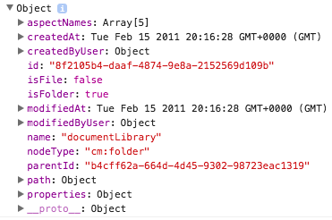

**Important note**: for this particular scenario you must also trigger `changeDetector.detectChanges()` as in the example above. 

## Custom icons for selected rows

You can use the "class" property of the "DataColumn" component to apply your custom css. 

As an example, this feature can be used to change the look and feel of the icon for the selected rows.

Let's start by assigning an "image-table-cell" class to the thumbnail column:

```html
<adf-document-list ...>
    <data-columns>
        
        <data-column
            key="$thumbnail"
            type="image"
            [sortable]="false"
            class="image-table-cell">
        </data-column>
        
        ...
    </data-columns>
</adf-document-list>
```

Now your application can define custom styles to change the content of the column based on some other conditions, like selection state:

```css
adf-document-list >>> adf-datatable tr.is-selected .image-table-cell {
    position: relative;
}

adf-document-list >>> adf-datatable tr.is-selected .image-table-cell::before {
    content: "\E876"; /* "done" */
    font-family: "Material Icons";
    font-size: 24px;
    line-height: 32px;
    text-align: center;
    color: white;
    position: absolute;
    width: 32px;
    height: 32px;
    top: 50%;
    left: 50%;
    margin-top: -16px;
    margin-left: -14px;
    border-radius: 100%;
    background: #00bcd4;
}
```

Once your application starts you should see the following icon for each selected row:

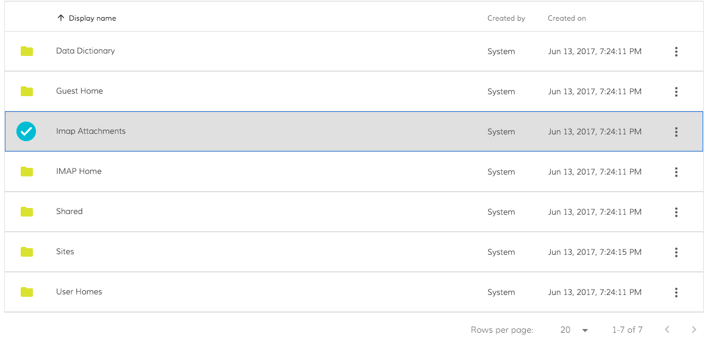

## Calling DocumentList api directly

Typically you will be binding DocumentList properties to your application/component class properties:

```html
<adf-document-list 
    [currentFolderId]="myStartFolder">
</adf-document-list>
```

with the underlying class being implemented similar to the following one:

```ts
@Component(...)
export class MyAppComponent {

    myStartFolder: string = '-my-';
    
}
```

However there may be scenarios that require you direct access to DocumentList apis. 
You can get reference to the DocumentList instance by means of Angular **Component Interaction** API.
See more details in [Parent calls a ViewChild](https://angular.io/docs/ts/latest/cookbook/component-communication.html#!#parent-to-view-child) 
section of the official docs.

Here's an example of getting reference:

```html
<adf-document-list 
    #documentList
    [currentFolderId]="myStartFolder">
</adf-document-list>
```

Note the `#documentList` ID we've just added to be able referencing this component later on.

```ts
import { ViewChild, AfterViewInit } from '@angular/core';
import { DocumentListComponent } from 'ng2-alfresco-documentlist';

@Component(...)
export class MyAppComponent implements AfterViewInit {

    myStartFolder: string = '-my-';
    
    @ViewChild(DocumentListComponent)
    documentList: DocumentListComponent;

    ngAfterViewInit() {
        console.log(this.documentList);
    }
}
```

Example above should produce the following browser console output:


Now you are able to access DocumentList properties or to call methods directly.

```ts
// print currently displayed folder node object to console
console.log(documentList.folderNode);
```

**Important note**:  
It is important accessing child components at least at the `AfterViewInit` state. 
Any UI click (buttons, links, etc.) event handlers are absolutely fine. This cannot be `ngOnInit` event though.
You can get more details in [Component lifecycle hooks](https://angular.io/docs/ts/latest/guide/lifecycle-hooks.html) article.

## Breadcrumb Component

DocumentList provides simple breadcrumb element to indicate the current position within a navigation hierarchy.

```html
<adf-breadcrumb
    [target]="documentList"
    [folderNode]="documentList.folderNode">
</adf-breadcrumb>
```

***Note:*** the `<adf-document-list-breadcrumb>` and `<adf-breadcrumb>` are the same component you can still use the old tag name

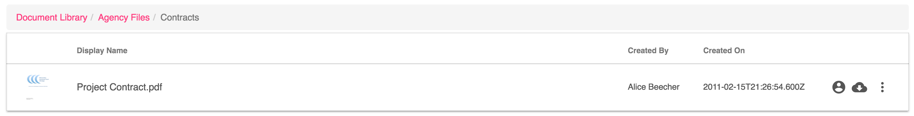

### Properties

| Name | Type | Description |
| --- | --- | --- |
| target | DocumentListComponent | (optional) DocumentList component to operate with. Upon clicks will instruct the given component to update. |
| folderNode | [MinimalNodeEntryEntity](https://github.com/Alfresco/alfresco-js-api/blob/master/src/alfresco-core-rest-api/docs/NodeMinimalEntry.md) | Active node, builds UI based on `folderNode.path.elements` collection. |
| root | String |  (optional) Name of the root element of the breadcrumb. You can use this property to rename "Company Home" to "Personal Files" for example.  |

### Events

| Name | Returned Type | Description |
| --- | --- | --- |
| navigate | [PathElementEntity](https://github.com/Alfresco/alfresco-js-api/blob/master/src/alfresco-core-rest-api/docs/PathElementEntity.md) |emitted when user clicks on a breadcrumb  |

## Dropdown Site Component

DocumentList now provides a simple dropdown component to show and interact with the sites of the current user.

```html
 <adf-sites-dropdown  
  (change)="getSiteContent($event)">
 </adf-sites-dropdown>
```
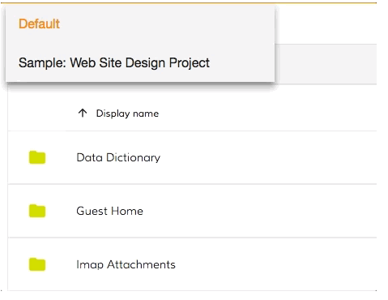

### Events

| Name | Returned Type | Description |
| --- | --- | --- |
| change | [SiteModel](https://github.com/Alfresco/alfresco-ng2-components/blob/development/ng2-components/ng2-alfresco-documentlist/src/models/site.model.ts) | emitted when user selects a site. When default option is selected an empty model is emitted  |

## Menu Actions

DocumentList provides simple creation menu actions that provide the action to create a new folder.

```html
<adf-document-menu-action 
    [folderId]="folderId">
</adf-document-menu-action>
```

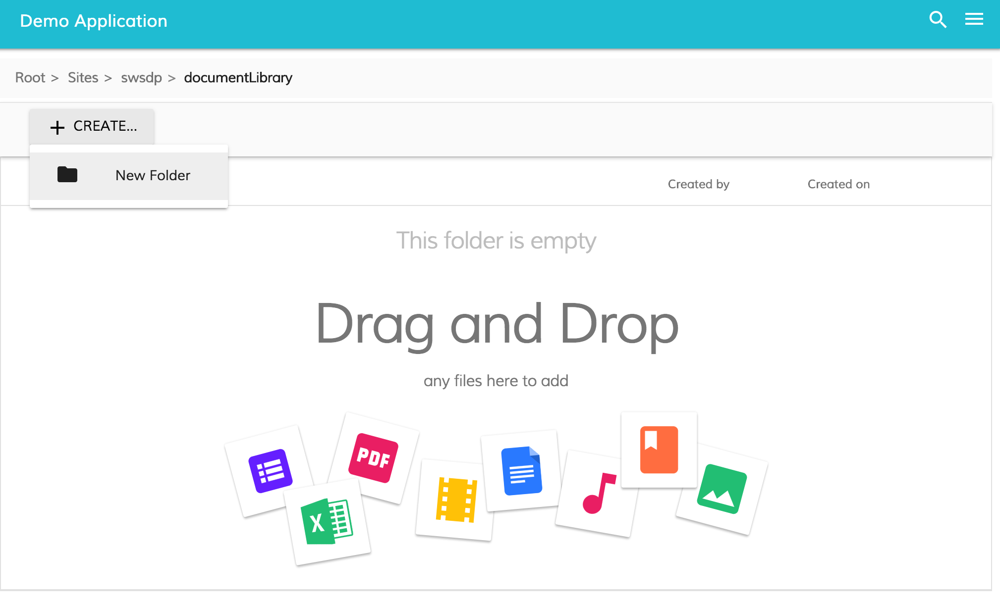

When the "New Folder" button is pressed the dialog appears.

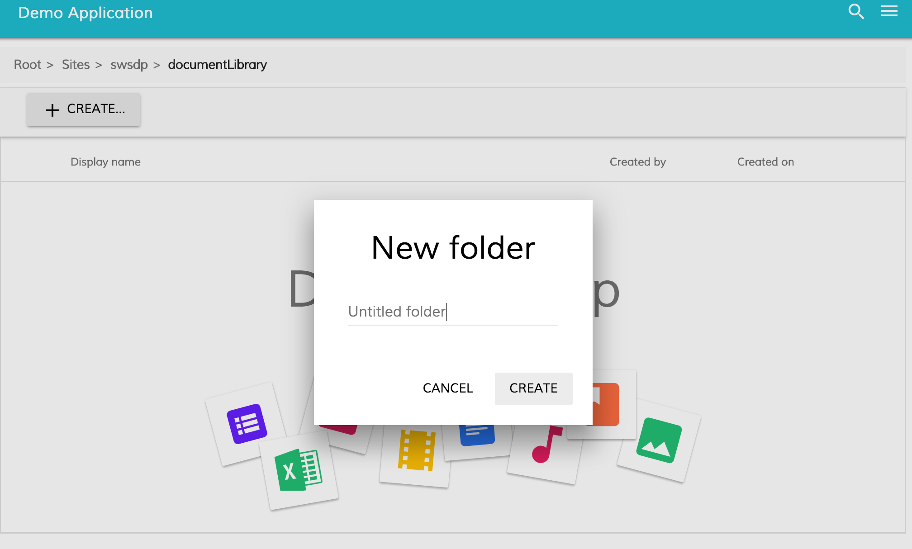

## Custom columns

It is possible to reorder, extend or completely redefine data columns displayed by the component.
By default special `$thumbnail` and `displayName` columns are rendered.

A custom set of columns can look like the following:

```html
<adf-document-list ...>
    <content-columns>
        <content-column key="$thumbnail" type="image"></content-column>
        <content-column 
            title="Name" 
            key="name" 
            sortable="true"
            class="full-width ellipsis-cell">
        </content-column>
        <content-column 
            title="Created By" 
            key="createdByUser.displayName"
            sortable="true"
            class="desktop-only">
        </content-column>
        <content-column 
            title="Created On" 
            key="createdAt" 
            type="date" 
            format="medium"
            sortable="true"
            class="desktop-only">
        </content-column>
    </content-columns>
</adf-document-list>
```

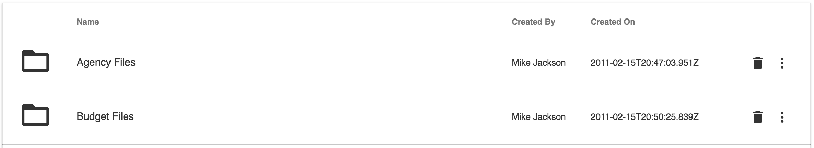

You can also use HTML-based schema declaration used by DataTable, TaskList and other components:

```html
<adf-datatable [data]="data" ...>
    <data-columns>
        <data-column type="image" key="icon" [sortable]="false"></data-column>
        <data-column key="id" title="Id"></data-column>
        <data-column key="createdOn" title="Created"></data-column>
        <data-column key="name" title="Name" class="full-width name-column"></data-column>
        <data-column key="createdBy.name" title="Created By"></data-column>
    </data-columns>
</adf-datatable>
```

### DataColumn Properties

Here's the list of available properties you can define for a Data Column definition.

| Name | Type | Default | Description |
| --- | --- | --- | --- |
| key | string | | Data source key, can be either column/property key like `title` or property path like `createdBy.name` |
| type | string (text\|image\|date) | text | Value type |
| format | string | | Value format (if supported by components), for example format of the date |
| sortable | boolean | true | Toggles ability to sort by this column, for example by clicking the column header |
| title | string | | Display title of the column, typically used for column headers |
| template | `TemplateRef` | | Custom column template |
| sr-title | string | | Screen reader title, used for accessibility purposes |
| class | string | | Additional CSS class to be applied to column (header and cells) |

DocumentList component assigns an instance of `MinimalNode` type (`alfresco-js-api`) as a data context of each row.

```js
export interface MinimalNode {
    id: string;
    parentId: string;
    name: string;
    nodeType: string;
    isFolder: boolean;
    isFile: boolean;
    modifiedAt: Date;
    modifiedByUser: UserInfo;
    createdAt: Date;
    createdByUser: UserInfo;
    content: ContentInfo;
    path: PathInfoEntity;
    properties: NodeProperties;
}
```

_See more details in [alfresco-js-api](https://github.com/Alfresco/alfresco-js-api/blob/master/index.d.ts) repository._

Binding to nested properties is also supported. You can define a column key as a property path similar to the following:

```text
createdByUser.displayName
```

Here's a short example:

```html
<adf-document-list ...>
    <content-columns>
        <content-column key="$thumbnail" type="image"></content-column>
        <content-column title="Name" key="name" class="full-width ellipsis-cell"></content-column>
        <content-column 
            title="Created By" 
            key="createdByUser.displayName">
        </content-column>
    </content-columns>
</adf-document-list>
```

## Column definition

Properties:

| Name | Type | Default | Description
| --- | --- | --- | --- |
| title | string | | Column title |
| sr-title | string | | Screen reader title, used only when `title` is empty |
| key | string | | Column source key, example: `createdByUser.displayName` |
| sortable | boolean | false | Toggle sorting ability via column header clicks |
| class | string | | CSS class list, example: `full-width ellipsis-cell` |
| type | string | text | Column type, text\|date\|number |
| format | string | | Value format pattern |
| template | `TemplateRef<any>` | | Column template |

For `date` column type the [DatePipe](https://angular.io/docs/ts/latest/api/common/DatePipe-class.html) formatting is used.
For a full list of available `format` values please refer to [DatePipe](https://angular.io/docs/ts/latest/api/common/DatePipe-class.html) documentation.

### Column Template

It is possible to provide custom column/cell template that may contain other Angular components or HTML elements:

Every cell in the DataTable component is bound to the dynamic data context containing the following properties:

| Name | Type | Description |
| --- | --- | --- |
| data | [DataTableAdapter](https://github.com/Alfresco/alfresco-ng2-components/tree/master/ng2-components/ng2-alfresco-datatable#data-sources) | Data adapter instance. |
| row | [DataRow](https://github.com/Alfresco/alfresco-ng2-components/tree/master/ng2-components/ng2-alfresco-datatable#data-sources) | Current data row instance.  |
| col | [DataColumn](https://github.com/Alfresco/alfresco-ng2-components/tree/master/ng2-components/ng2-alfresco-datatable#data-sources) | Current data column instance. |

You can use all three properties to gain full access to underlying data from within your custom templates. 
In order to wire HTML templates with the data context you will need defining a variable that is bound to `$implicit` like shown below:

```html
<template let-context="$implicit">
    <!-- template body -->
</template>
```

The format of naming is `let-VARIABLE_NAME="$implicit"` where `VARIABLE_NAME` is the name of the variable you want to bind template data context to.

Getting a cell value from the underlying DataTableAdapter:

```ts
context.data.getValue(entry.row, entry.col);
```

You can retrieve all property values for underlying node, including nested properties (via property paths):

```ts
context.row.getValue('name')
context.row.getValue('createdByUser.displayName')
```

You may want using **row** api to get raw value access.

```html
<content-column title="Name" key="name" sortable="true" class="full-width ellipsis-cell">
    <template let-context="$implicit">
        <span>Hi! {{context.row.getValue('createdByUser.displayName')}}</span>
        <span>Hi! {{context.row.getValue('name')}}</span>
    </template>
</content-column>
```

Use **data** api to get values with post-processing, like datetime/icon conversion._

In the Example below we will prepend `Hi!` to each file and folder name in the list: 

```html
<content-column title="Name" key="name" sortable="true" class="full-width ellipsis-cell">
    <template let-entry="$implicit">
        <span>Hi! {{entry.data.getValue(entry.row, entry.col)}}</span>
    </template>
</content-column>
```

In the Example below we will add the [ng2-alfresco-tag](https://www.npmjs.com/package/ng2-alfresco-tag) component is integrate in the document list.

```html
<content-column
    title="{{'DOCUMENT_LIST.COLUMNS.TAG' | translate}}"
    key="id"
    sortable="true"
    class="full-width ellipsis-cell">
    <template let-entry="$implicit">
        <adf-tag-node-list  [nodeId]="entry.data.getValue(entry.row, entry.col)"></adf-tag-node-list>
    </template>
</content-column>
```

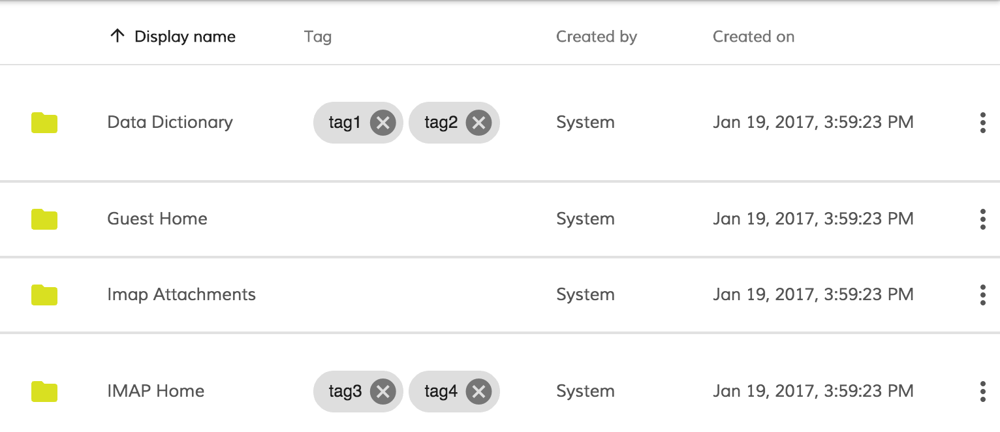

### Actions

Properties:

| Name | Type | Default | Description |
| --- | --- | --- | --- |
| `target` | string | | "document" or "folder" |
| `title` | string | | The title of the action as shown in the menu |
| `handler` | string | | System type actions. Can be "delete" or "download" |
| `permission` | string | | The name of the permission |

Events:

| Name | Description |
| --- | --- |
| `execute` | Emitted when user clicks on the action. For combined handlers see below |
| `permissionEvent` | Emitted when a permission error happens |

DocumentList supports declarative actions for Documents and Folders.
Each action can be bound to either default out-of-the-box handler, to a custom behaviour or to both.
You can define both folder and document actions at the same time.

#### Menu actions

```html
<adf-document-list ...>
    <content-actions>

        <!-- system handler -->
        <content-action
            icon="content_copy"
            target="document"
            title="copy"
            permission="update"
            [disableWithNoPermission]="true"
            handler="copy">
        </content-action>

        <!-- custom handler -->
        <content-action
            target="document"
            title="Custom action"
            (execute)="myCustomAction1($event)">
        </content-action>

        <!-- combined handler -->
        <content-action
            target="document"
            title="Delete with additional custom callback"
            handler="delete"
            permission="delete"
            (execute)="myCustomActionAfterDelete($event)">
        </content-action>

    </content-actions>
</adf-document-list>
```

```ts
export class MyView {
    // ...

    myCustomAction1(event) {
        let entry = event.value.entry;
        alert(`Custom document action for ${entry.name}`);
    }

    myCustomActionAfterDelete(event) {
        let entry = event.value.entry;
        alert(`Custom callback after delete system action for ${entry.name}`);
    }
}
```

All document actions are rendered as a dropdown menu as on the picture below:

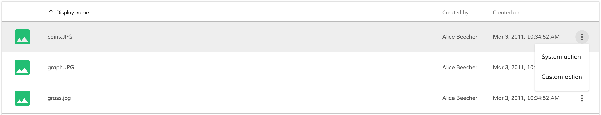

#### Default action handlers

The following action handlers are provided out-of-box:

- **Download** (document)
- **Copy** (document, folder)
- **Move** (document, folder)
- **Delete** (document, folder)

All system handler names are case-insensitive, `handler="download"` and `handler="DOWNLOAD"`
will trigger the same `download` action.

##### Delete - System handler combined with custom handler

If you specify both **handler="delete"** and your custom **(execute)="myCustomActionAfterDelete($event)"**, your callback will be invoked after a successful delete happened. A successful delete operation happens if there is neither permission error, nor other network related error for the delete operation request. For handling permission errors see the section below.

##### Delete - Show notification message with no permission

You can show a notification error when the user doesn't have the right permission to perform the action.
The ContentActionComponent provides the event permissionEvent that is raised when the permission specified in the permission property is missing
You can subscribe to this event from your component and use the NotificationService to show a message.

```html
<adf-document-list ...>
    <content-actions>

        <content-action
            target="document"
            title="Delete"
            permission="delete"
            (permissionEvent)="onPermissionsFailed($event)"
            handler="delete">
        </content-action>

    </content-actions>
</adf-document-list>
```

```ts
export class MyComponent {

    onPermissionsFailed(event: any) {
        this.notificationService.openSnackMessage(`you don't have the ${event.permission} permission to ${event.action} the ${event.type} `, 4000);
    }

}
```

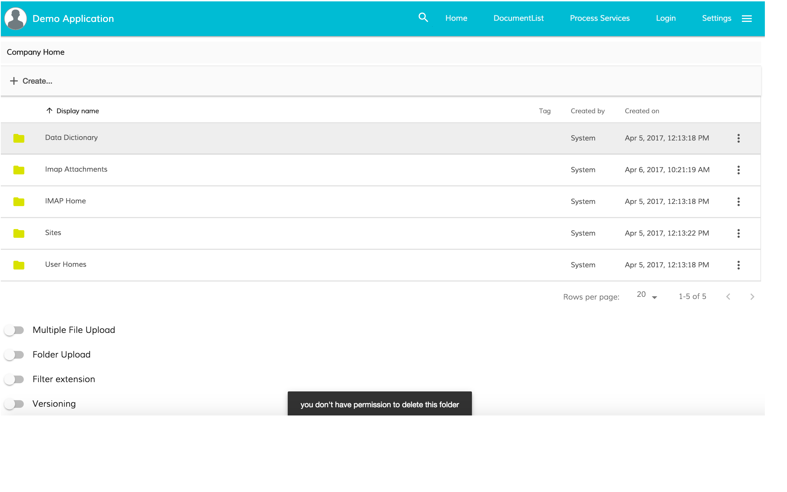

##### Delete - Disable button checking the permission

You can easily disable a button when the user doesn't own the permission to perform the action related to the button.
The ContentActionComponent provides the property permission that must contain the permission to check and a property disableWithNoPermission that can be true if
 you want to see the button disabled.

```html
<adf-document-list ...>
    <content-actions>

        <content-action
            target="document"
            title="Delete"
            permission="delete"
            disableWithNoPermission="true"
            handler="delete">
        </content-action>

    </content-actions>
</adf-document-list>
```

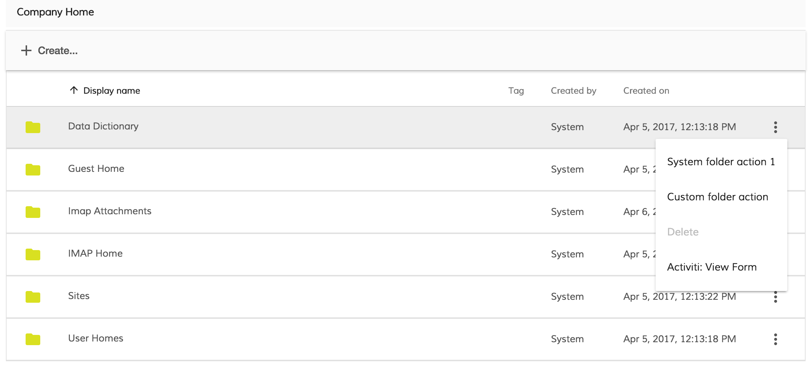

##### Download

Initiates download of the corresponding document file.

```html
<adf-document-list ...>
    <content-actions>

        <content-action
            target="document"
            title="Download"
            handler="download">
        </content-action>

    </content-actions>
</adf-document-list>
```

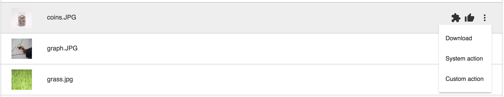

##### Copy and move

Shows the destination chooser dialog for copy and move actions

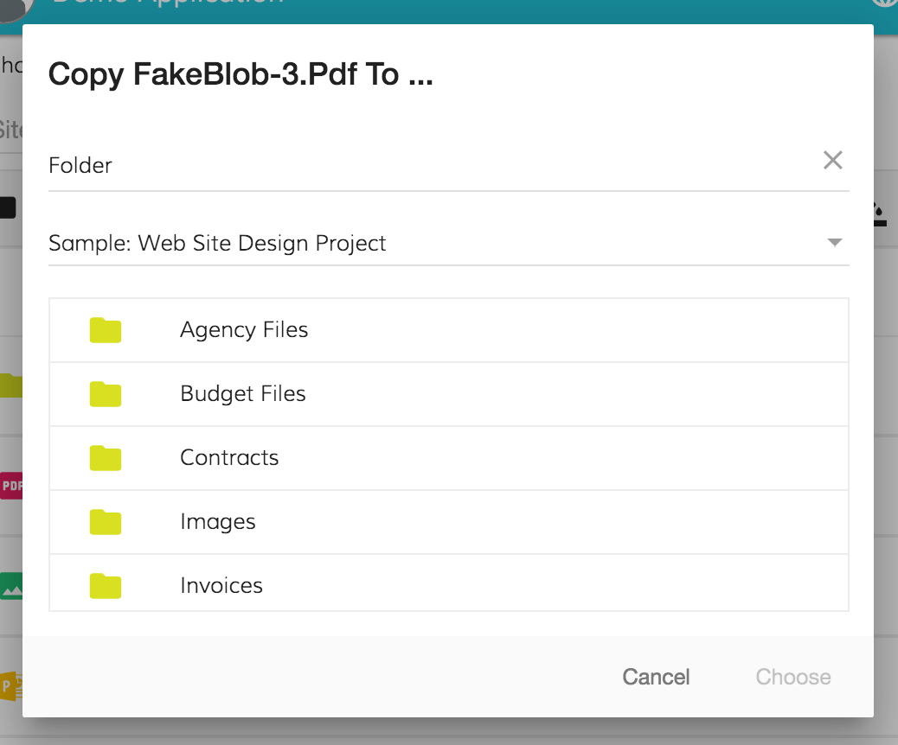

```html
<adf-document-list ...>
    <content-actions>

        <content-action
            icon="content_copy"
            target="document"
            title="copy"
            permission="update"
            [disableWithNoPermission]="true"
            handler="copy">
        </content-action>

        <content-action
            icon="redo"
            target="document"
            title="move"
            permission="update"
            [disableWithNoPermission]="true"
            handler="move">
        </content-action>

    </content-actions>
</adf-document-list>
```

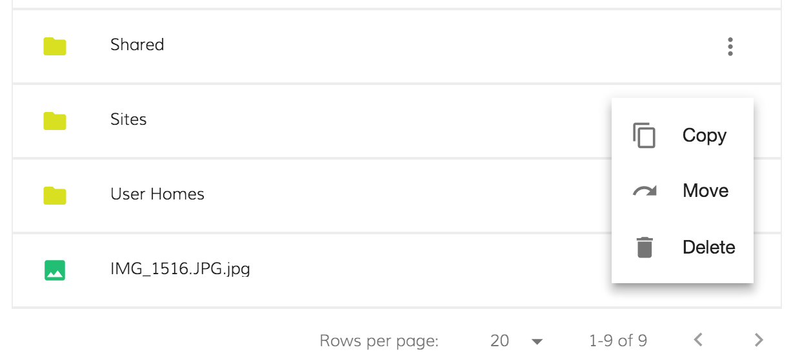

#### Folder actions

Folder actions have the same declaration as document actions except ```target="folder"``` attribute value. You can define system, custom or combined handlers as well just as with the document actions.

```html
<adf-document-list ...>
    <content-actions>

        <!-- system handler -->
        <content-action
            target="folder"
            title="Default folder action 1"
            handler="system1">
        </content-action>

        <!-- custom handler -->
        <content-action
            target="folder"
            title="Custom folder action"
            (execute)="myFolderAction1($event)">
        </content-action>

        <!-- combined handler -->
        <content-action
            target="folder"
            title="Delete with additional custom callback"
            handler="delete"
            (execute)="myCustomActionAfterDelete($event)">
        </content-action>

    </content-actions>
</adf-document-list>
```

```ts
export class MyView {
    // ...

    myFolderAction1(event) {
        let entry = event.value.entry;
        alert(`Custom folder action for ${entry.name}`);
    }

    myCustomActionAfterDelete(event) {
        let entry = event.value.entry;
        alert(`Custom callback after delete system action for ${entry.name}`);
    }
}
```

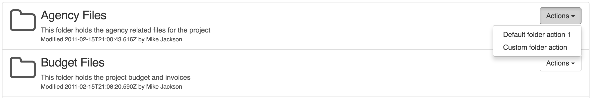

### Context Menu

DocumentList also provides integration for 'Context Menu Service' from the 
[ng2-alfresco-core](https://www.npmjs.com/package/ng2-alfresco-core) library.

You can automatically turn all menu actions (for the files and folders) 
into context menu items like shown below:

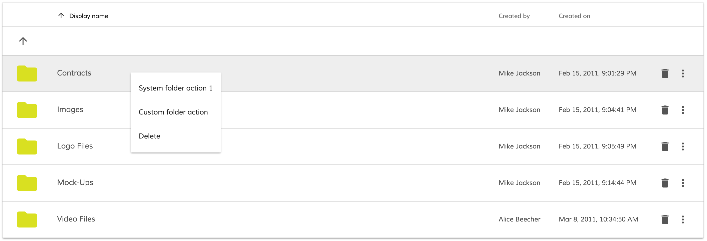

Enabling context menu is very simple:

```ts
@Component({
    selector: 'my-view',
    template: `
        <adf-document-list>...</adf-document-list>
        <context-menu-holder></context-menu-holder>
    `
})
export class MyView {
}
```

This enables context menu items for documents and folders.

### Navigation mode

By default DocumentList component uses 'double-click' mode for navigation.
That means user will see the contents of the folder by double-clicking its name
or icon (similar to Google Drive behaviour). However it is possible switching to 
other modes, like single-click navigation for example.
 
The following navigation modes are supported:

- **click**
- **dblclick**

The following example switches navigation to single clicks:

```html
<adf-document-list 
    [navigationMode]="'click'">
</adf-document-list>
```

### Events

DocumentList emits the following events:

| Name | Description |
| --- | --- |
| nodeClick | emitted when user clicks a list node |
| nodeDblClick | emitted when user double-clicks list node |
| folderChange | emitted once current display folder has changed |
| preview | emitted when user acts upon files with either single or double click (depends on `navigation-mode`), recommended for Viewer components integration  |
| permissionError | emitted when user is attempting to create a folder via action menu without having the permission to do it |
| ready | emitted when the documentList is ready and loads all the elements|

## Advanced usage and customization

### Custom row filter

You can create a custom row filter implementation that returns `true` if row should be displayed or `false` to hide it.
Typical row filter implementation is a function that receives `ShareDataRow` as parameter:

```ts
myFilter(row: ShareDataRow): boolean {
    return true;
}
```

_Note that for the sake of simplicity the example code below was reduced to the main points of interest only._

**View1.component.html**

```html
<adf-document-list 
    [rowFilter]="folderFilter">
</adf-document-list>
```

**View1.component.ts**

```ts
import { RowFilter, ShareDataRow } from 'ng2-alfresco-documentlist';

export class View1 {

    folderFilter: RowFilter;

    constructor() {
    
        // This filter will make document list show only folders
        
        this.folderFilter = (row: ShareDataRow) => {
            let node = row.node.entry;
            
            if (node && node.isFolder) {
                return true;
            }
            
            return false;
        };
    }
}
```

### Custom image resolver

You can create a custom image resolver implementation and take full control over how folder/file icons and thumbnails 
are resolved and what document list should display. 

**Image resolvers are executed only for columns of the `image` type.**

Typical image resolver implementation is a function that receives `DataRow` and `DataColumn` as parameters:

```ts
myImageResolver(row: DataRow, col: DataColumn): string {
    return '/path/to/image';
}
```

Your function can return `null` or `false` values to fallback to default image resolving behavior.

_Note that for the sake of simplicity the example code below was reduced to the main points of interest only._

**View1.component.html**

```html
<adf-document-list 
    [imageResolver]="folderImageResolver">
    
    <content-columns>
        <content-column key="name" type="image"></content-column>
    </content-columns>
    
    
</adf-document-list>
```

**View1.component.ts**

```ts
import { DataColumn, DataRow } from 'ng2-alfresco-datatable';
import { ImageResolver } from 'ng2-alfresco-documentlist';

export class View1 {

    folderImageResolver: ImageResolver;
    
    constructor() {
        
        // Customize folder icons, leave file icons untouched
        
        this.folderImageResolver = (row: DataRow, col: DataColumn) => {
            let isFolder = <boolean> row.getValue('isFolder');
            if (isFolder) {
                
                // (optional) You may want dynamically getting the column value
                let name = row.getValue(col.key);
                
                // Format image url
                return `http://<my custom path to folder icon>/${name}`;
            }
            
            // For the rest of the cases just fallback to default behaviour.
            return null;
        };
        
    }

}
```

### Hiding columns on small screens

You can hide columns on small screens by means of custom CSS rules:

```css
@media all and (max-width: 768px) {

    alfresco-document-list >>> th.desktop-only .cell-value {
        display: none;
    }

    alfresco-document-list >>> td.desktop-only .cell-value {
        display: none;
    }
}
```

Now you can declare columns and assign `desktop-only` class where needed:

```html
<adf-document-list ...>
    <content-columns>
        
        <!-- always visible columns -->
        
        <content-column key="$thumbnail" type="image"></content-column>
        <content-column 
                title="Name" 
                key="name" 
                class="full-width ellipsis-cell">
        </content-column>
        
        <!-- desktop-only columns -->
        
        <content-column
                title="Created by"
                key="createdByUser.displayName"
                class="desktop-only">
        </content-column>
        <content-column
                title="Created on"
                key="createdAt"
                type="date"
                format="medium"
                class="desktop-only">
        </content-column>
    </content-columns>
</adf-document-list>
```

**Desktop View**

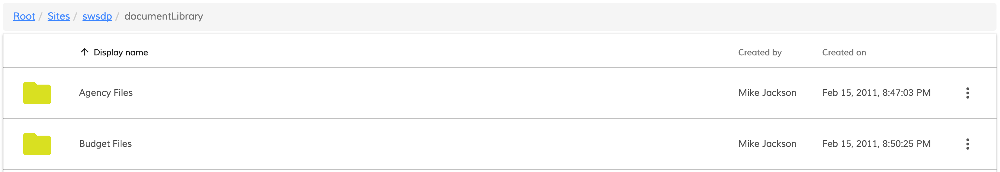

**Mobile View**

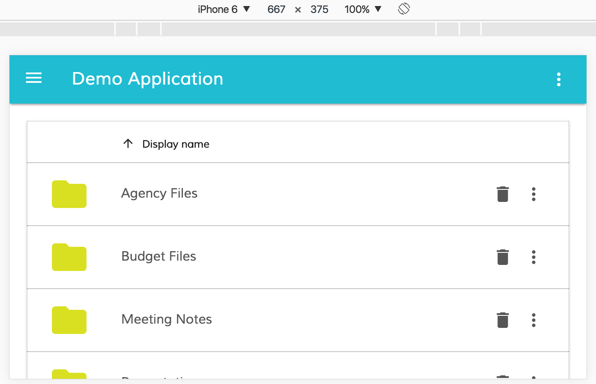

### Custom row permissions style

You can customize the style of the row based on the permissions.
The property to use is permissionsStyle[]:[PermissionStyleModel[]](https://github.com/Alfresco/alfresco-ng2-components/blob/master/ng2-components/ng2-alfresco-documentlist/src/models/permissions-style.model.ts).
The permissionsStyle array can define different styles depending on the permission of the user on that node.

[PermissionStyleModel](https://github.com/Alfresco/alfresco-ng2-components/blob/master/ng2-components/ng2-alfresco-documentlist/src/models/permissions-style.model.ts)

| Property | Description |
| --- | --- |
| isFile/isFolder | allow you to select if you want apply the style to file/folder nodes |
| permission | is an enum value [Permissions](https://github.com/Alfresco/alfresco-ng2-core/blob/master/ng2-components/ng2-alfresco-documentlist/src/models/permissions.enum.ts) | 
| css| the name of the class to add | 

#### Examples

If you want to change the style on rows where the user can create content: 

```ts
let permissionsStyle: PermissionStyleModel[] = [];

this.permissionsStyle.push(new PermissionStyleModel('document-list__create', PermissionsEnum.CREATE));        
```

```html
<adf-document-list [permissionsStyle]="permissionsStyle">
</adf-document-list>
```

```css
adf-document-list >>> adf-datatable tr.document-list__create {
    background: green !important;
}
```

If you want to change the style on the folders where the user doesn't have the permission to update: 

```ts

let permissionsStyle: PermissionStyleModel[] = [];

this.permissionsStyle.push(new PermissionStyleModel('document-list__disable', PermissionsEnum.NOT_CREATE, false, true));

```

```html
<adf-document-list [permissionsStyle]="permissionsStyle">
</adf-document-list>
```

```css
adf-document-list >>> adf-datatable tr.document-list__disable {
    background: red !important;
}
```

### Custom 'empty folder' template

By default DocumentList provides the following content for the empty folder:

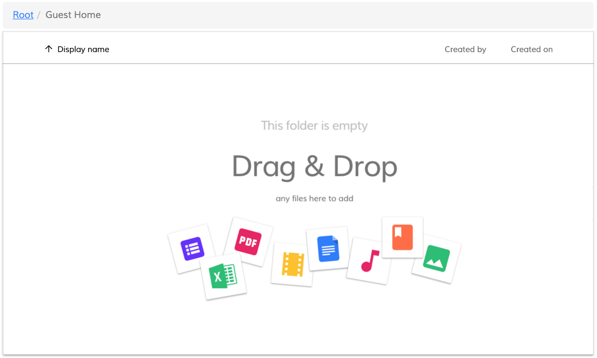

This can be changed by means of the custom html template:

```html
<adf-document-list ...>
    <empty-folder-content>
        <template>
            <h1>Sorry, no content here</h1>
        </template>
    </empty-folder-content>
</adf-document-list>
```

That will give the following output:

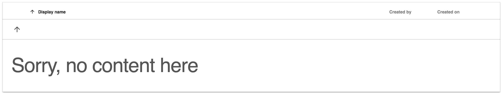

### Customizing default actions

It is possible extending or replacing the list of available system actions for documents and folders.
Actions for the documents and folders can be accessed via the following services:

- `DocumentActionsService`, document action menu and quick document actions
- `FolderActionsService`, folder action menu and quick folder actions

Example below demonstrates how a new action handler can be registered with the
`DocumentActionsService`.

```html
<adf-document-list ...>
    <content-actions>

        <content-action
            target="document"
            title="My action"
            handler="my-handler">
        </content-action>

    </content-actions>
</adf-document-list>
```

You register custom handler called `my-handler` that will be executing `myDocumentActionHandler`
function each time upon being invoked.

```ts
import { DocumentActionsService } from 'ng2-alfresco-documentlist';

export class MyView {

    constructor(documentActions: DocumentActionsService) {
        documentActions.setHandler(
            'my-handler',
            this.myDocumentActionHandler.bind(this)
        );
    }

    myDocumentActionHandler(obj: any) {
        window.alert('my custom action handler');
    }
}
```

The same approach allows changing the way out-of-box action handlers behave.
Registering custom action with the name `download` replaces default one:

```ts
export class MyView {

    constructor(documentActions: DocumentActionsService) {
        documentActions.setHandler(
            'download',
            this.customDownloadBehavior.bind(this)
        );
    }

    customDownloadBehavior(obj: any) {
        window.alert('my custom download behavior');
    }
}
```

Typically you may want populating all your custom actions at the application root level or
by means of custom application service.

## Build from sources

You can build component from sources with the following commands:

```sh
npm install
npm run build
```

> The `build` task rebuilds all the code, runs tslint, license checks 
> and other quality check tools before performing unit testing.

## NPM scripts

| Command | Description |
| --- | --- |
| npm run build | Build component |
| npm run test | Run unit tests in the console |
| npm run test-browser | Run unit tests in the browser
| npm run coverage | Run unit tests and display code coverage report |

## Demo

Please check the demo folder for a demo project

```sh
cd demo
npm install
npm start
```

## License

[Apache Version 2.0](https://github.com/Alfresco/alfresco-ng2-components/blob/master/LICENSE)
