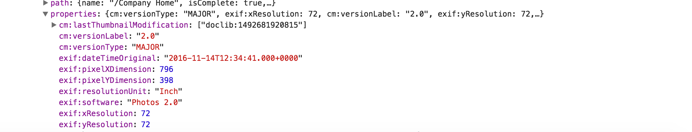
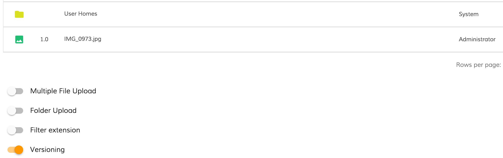
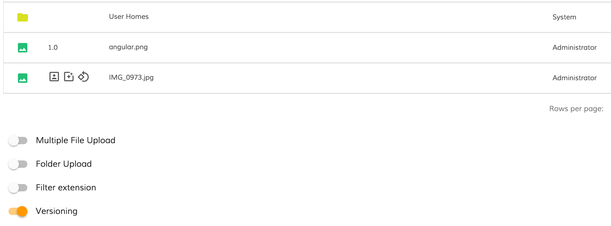

# Walkthrough: adding indicators to clearly highlight information about a node

Every node object in the document list holds metadata information. 
All metadata is stored inside `properties` property. 

Here's an example of basic image-related metadata fetched from the server:



## Custom column template

```html
<alfresco-document-list ...>
    <data-columns>
        <data-column key="properties" [sortable]="false">
            <template let-value="value">
                <adf-metadata-icons [metadata]="value">
                </adf-metadata-icons>
            </template>
        </data-column>
        ...
    </data-columns>
</alfresco-document-list>
```

We are going to declare a column and bind its value to the entire `properties` object of the underlying node. The column will be using our custom `<adf-metadata-icons>` component to display icons based on metadata state.

## MetadataIconsComponent component

Let's create a simple `MetadataIconsComponent` component with a selector set to `adf-metadata-icons` as shown below:

```ts
import { Component, Input } from '@angular/core';

@Component({
    selector: 'adf-metadata-icons',
    template: `
        <div *ngIf="metadata">
            <!-- render UI based on metadata -->
        </div>
    `
})
export class MetadataIconsComponent {

    @Input()
    metadata: any;

}
```

The component will expose a `metadata` property we can use from the outside and eventually bind data to similar to the following:

```html
<adf-metadata-icons [metadata]="nodeMetadata"></adf-metadata-icons>
``` 

As you have seen earlier the DataColumn binds to `properties` property of the node, and maps the runtime value as the `value` local variable within the template. 
Next we propagate the `value` reference to the `<adf-metadata-icons>` component as `metadata` property.

```html
<data-column key="properties" [sortable]="false">
    <template let-value="value">
        <adf-metadata-icons [metadata]="value"></adf-metadata-icons>
    </template>
</data-column>
```

So once rendered our component will automatically has access to entire set of node metadata. Let's build some visualization of the `cm:versionLabel` propery. 

For demonstration purposes we are going to display several icons if underlying node has version `2.0`, and just a plain text version value for all other versions.

```html
<div *ngIf="metadata">
    <ng-container *ngIf="metadata['cm:versionLabel'] === '2.0'">
        <md-icon>portrait</md-icon>
        <md-icon>photo_filter</md-icon>
        <md-icon>rotate_90_degrees_ccw</md-icon>
    </ng-container>
    <div *ngIf="metadata['cm:versionLabel'] !== '2.0'">
        {{metadata['cm:versionLabel']}}
    </div>
</div>
```

Note: For a list of the icons that can be used with `<md-icon>` component please refer to this resource: [material.io/icons](https://material.io/icons/)

## Testing component

You will need to enable `versioning` feature for the Document List to be able uploading multiple versions of the file instead of renaming duplicates.

Drag and drop any image file to upload it and ensure it has `1.0` displayed in the column:



Now drop the same file again to upload a new version of the file. 
You should now see icons instead of version label. 



You can see on the screnshot above that only files with version `2.0` got extra icons.

## Conclusion

The full source code of the component can be found below:

```ts
import { Component, Input } from '@angular/core';

@Component({
    selector: 'adf-metadata-icons',
    template: `
        <div *ngIf="metadata">
            <ng-container *ngIf="metadata['cm:versionLabel'] === '2.0'">
                <md-icon>portrait</md-icon>
                <md-icon>photo_filter</md-icon>
                <md-icon>rotate_90_degrees_ccw</md-icon>
            </ng-container>
            <div *ngIf="metadata['cm:versionLabel'] !== '2.0'">
                {{metadata['cm:versionLabel']}}
            </div>
        </div>
    `
})
export class MetadataIconsComponent {

    @Input()
    metadata: any;

}
```

You can use this idea to build more complex indication experience based on the actual metdata state. 