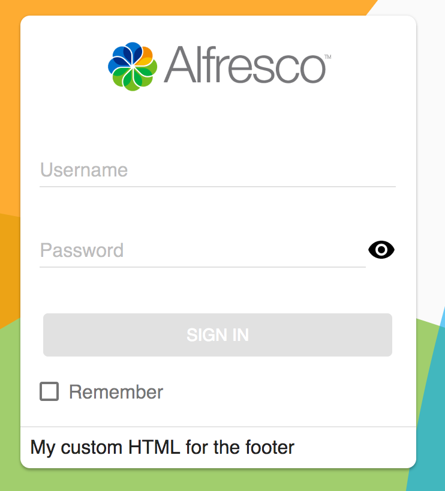
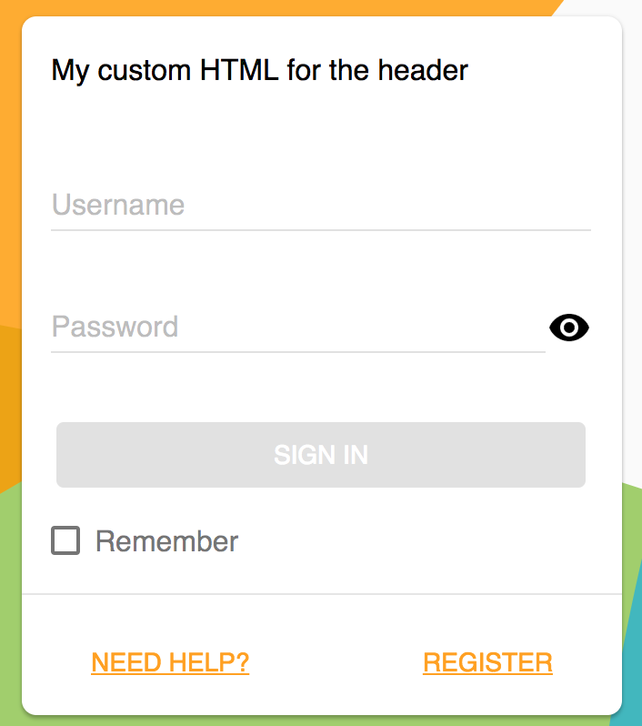
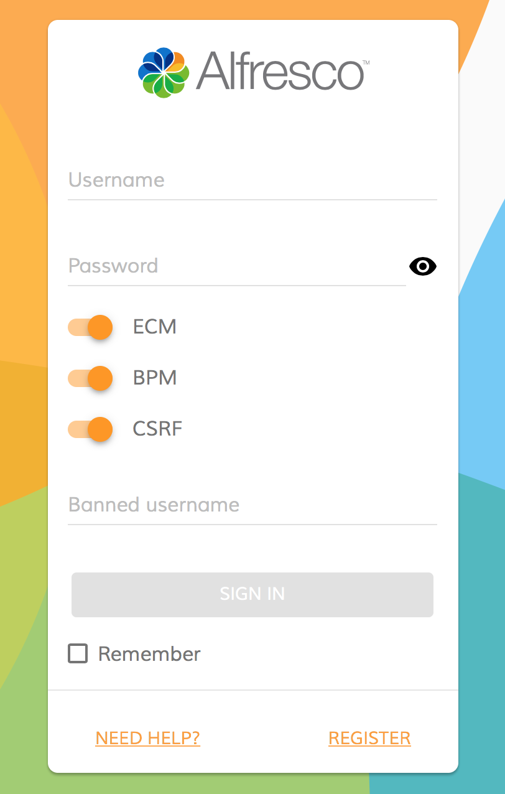

# Login library

Contains the Login component.

<!-- markdown-toc start - Don't edit this section.  npm run toc to generate it-->

<!-- toc -->

- [Login component](#login-component)
  * [Basic usage](#basic-usage)
    + [Properties](#properties)
    + [Events](#events)
  * [Details](#details)
    + [Change footer content](#change-footer-content)
    + [Change header content](#change-header-content)
    + [Extra content](#extra-content)
    + [Custom logo and background](#custom-logo-and-background)
    + [Customize Validation rules](#customize-validation-rules)
    + [Controlling form submit execution behaviour](#controlling-form-submit-execution-behaviour)
- [Project Information](#project-information)
  * [Prerequisites](#prerequisites)
  * [Install](#install)
  * [Build from sources](#build-from-sources)
  * [NPM scripts](#npm-scripts)
  * [Demo](#demo)
  * [License](#license)

<!-- tocstop -->

<!-- markdown-toc end -->

## Login component

Authenticates to Alfresco Content Services and Alfresco Process Services.

### Basic usage

**app.component.html**

```html
<adf-login 
    [providers]="'ALL'"
    (onSuccess)="mySuccessMethod($event)"
    (onError)="myErrorMethod($event)">
</adf-login>
```

**app.component.ts**

```ts
export class AppComponent {

    mySuccessMethod($event) {
        console.log('Success Login EventEmitt called with: ' + $event.value);
    }

    myErrorMethod($event) {
        console.log('Error Login EventEmitt called with: ' + $event.value);
    }
}
```

#### Properties

| Name | Type | Default Value | Description |
| --- | --- | --- | --- |
| providers | string | ECM | Possible valid values are ECM, BPM or ALL. The default behaviour of this component will log in only in the ECM . If you want to log in in both systems the correct value to use is ALL |
| disableCsrf | boolean | false | To prevent the CSRF Token from being submitted. Only for Alfresco Process Services call |
| needHelpLink | string | | It will change the url of the NEED HELP link in the footer  |
| registerLink | string | | It will change the url of the REGISTER link in the footer |
| logoImageUrl | string | Alfresco logo image | To change the logo image with a customised image |
| copyrightText | string | © 2017 Alfresco Software, Inc. All Rights Reserved. | The copyright text below the login box |
| backgroundImageUrl | string | Alfresco background image | To change the background image with a customised image |
| fieldsValidation | { [key: string]: any; }, extra?: { [key: string]: any; } |  | Use it to customise the validation rules of the login form |
| showRememberMe | boolean | false | Toggle `Remember me` checkbox visibility |
| showLoginActions | boolean | false | Toggle extra actions visibility (`Need Help`, `Register`, etc.) |

#### Events

| Name | Description |
| --- | --- |
| onSuccess | Raised when the login is done |
| onError | Raised when the login fails |
| executeSubmit | Raised when the form is submitted |

### Details

#### Change footer content



You can replace the entire content in the footer of the login component with your custom content.

```html
<adf-login ...>
    <login-footer><template>My custom HTML for the footer</template></login-footer>
</adf-login>`
```

#### Change header content



You can replace the entire content in the header of the login component with your custom content.

```html
<adf-login ...>
    <login-header><template>My custom HTML for the header</template></login-header>
</adf-login>`
```

#### Extra content

You can put additional html content between `alfresco-login` tags to get it rendered as part of the login dialog.
This becomes handy in case you need to extend it with custom input fields handled by your application or parent component:

```html
<adf-login ...>
    <div>
        <div>Your extra content</div>
    </div>
</adf-login>
```

Here's an example of custom content:



#### Custom logo and background

It is possible changing logo and background images to custom values.

```html
<adf-login 
    [backgroundImageUrl]="'http://images.freeimages.com/images/previews/638/wood-wall-for-background-1634466.jpg'"
    [logoImageUrl]="'http://images.freeimages.com/images/previews/eac/honeybee-with-a-house-1633609.jpg'">
</adf-login>
```

Should give you something like the following:


Alternatively you can bind to your component properties and provide values dynamically if needed:

```html
<adf-login
    [backgroundImageUrl]="myCustomBackground"
    [logoImageUrl]="myCustomLogo">
</adf-login>
```

#### Customize Validation rules

If needed it is possible to customise the validation rules of the login
form. You can add/modify the default rules of the login form.

**MyCustomLogin.component.html**

```html
<adf-login 
    [fieldsValidation]="customValidation"
    #alfrescologin>
</adf-login>
```

**MyCustomLogin.component.ts**

```ts
export class MyCustomLogin {
    
    @ViewChild('alfrescologin')
    alfrescologin: any;

    customValidation: any;

    constructor(public router: Router) {
        this.customValidation = {
            username: ['', Validators.compose([Validators.required, Validators.minLength(8), Validators.maxLength(10)])],
            password: ['', Validators.required]
        };
    }

    ngOnInit() {
        this.alfrescologin.addCustomValidationError('username', 'minlength', 'Username must be at least 8 characters.');
        this.alfrescologin.addCustomValidationError('username', 'maxlength', 'Username must not be longer than 11 characters.');
    }
}
```

#### Controlling form submit execution behaviour

If absolutely needed it is possible taking full control over form 
submit execution by means of `executeSubmit` event. 
This event is fired on form submit.

You can prevent default behaviour by calling `event.preventDefault()`. 
This allows for example having custom form validation scenarios and/or additional validation summary presentation.

Alternatively you may want just running additional code without suppressing default one.

**MyCustomLogin.component.html**

```html
<adf-login 
    (executeSubmit)="validateForm($event)" 
    #alfrescologin>
</adf-login>
```

**MyCustomLogin.component.ts**

```ts
export class MyCustomLogin {

    validateForm(event: any) {
        let values = event.values;
        
        // check if the username is in the blacklist
        if (values.controls['username'].value === 'invalidUsername') {
            this.alfrescologin.addCustomFormError('username', 'the
            username is in blacklist');
            event.preventDefault();
        }
    }
    
}
```

**Please note that if `event.preventDefault()` is not called then default behaviour 
will also be executed after your custom code.**

## Project Information

### Prerequisites

Before you start using this development framework, make sure you have installed all required software and done all the
necessary configuration, see this [page](https://github.com/Alfresco/alfresco-ng2-components/blob/master/PREREQUISITES.md).

> If you plan using this component with projects generated by Angular CLI, please refer to the following article: [Using ADF with Angular CLI](https://github.com/Alfresco/alfresco-ng2-components/wiki/Angular-CLI)

See it live: [Login Quickstart](http://embed.plnkr.co/PfZytJyHcl3xIsa8pdMo/)

### Install

```sh
npm install ng2-alfresco-login
```

### Build from sources

You can build component from sources with the following commands:

```sh
npm install
npm run build
```

> The `build` task rebuilds all the code, runs tslint, license checks 
> and other quality check tools before performing unit testing.

### NPM scripts

| Command | Description |
| --- | --- |
| npm run build | Build component |
| npm run test | Run unit tests in the console |
| npm run test-browser | Run unit tests in the browser
| npm run coverage | Run unit tests and display code coverage report |

### Demo

Please check the demo folder for a demo project

```sh
cd demo
npm install
npm start
```

### License

[Apache Version 2.0](https://github.com/Alfresco/alfresco-ng2-components/blob/master/LICENSE)
