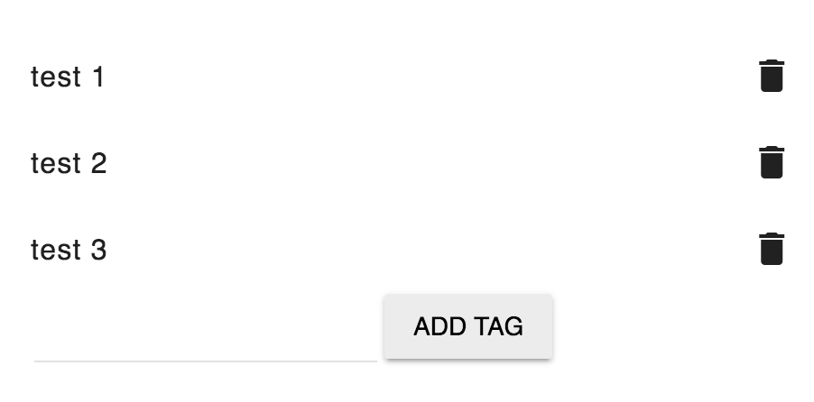
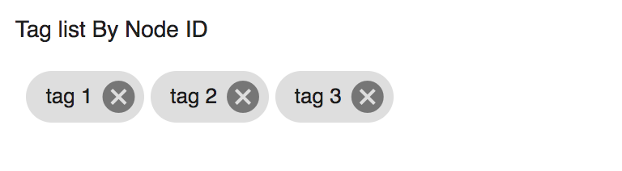

# Alfresco Tag Component

Contains the Alfresco Tag Node Actions list, Tag List and Node List components.

<!-- markdown-toc start - Don't edit this section.  npm run toc to generate it-->

<!-- toc -->

- [Alfresco Tag Node Actions List component](#alfresco-tag-node-actions-list-component)
  * [Basic Usage](#basic-usage)
    + [Properties](#properties)
- [Alfresco Tag Node List component](#alfresco-tag-node-list-component)
  * [Basic Usage](#basic-usage-1)
    + [Properties](#properties-1)
- [Alfresco Tag List component](#alfresco-tag-list-component)
- [Project Information](#project-information)
  * [Prerequisites](#prerequisites)
  * [Install](#install)
  * [Build from sources](#build-from-sources)
  * [NPM scripts](#npm-scripts)
  * [Demo](#demo)
  * [License](#license)

<!-- tocstop -->

<!-- markdown-toc end -->

## Alfresco Tag Node Actions List component



### Basic Usage

```html
<adf-tag-node-actions-list 
    [nodeId]="nodeId">
</adf-tag-node-actions-list>
```  

#### Properties

| Attribute | Type | Default | Description |
| --- | --- | --- | --- |
| nodeId | string | | The identifier of a node |

## Alfresco Tag Node List component

### Basic Usage

```html
<adf-tag-node-list 
    [nodeId]="nodeId">
</adf-tag-node-list>
``` 

#### Properties

| Attribute | Type | Default | Description |
| --- | --- | --- | --- |
| nodeId | string | | The identifier of a node |

                         

## Alfresco Tag List component

                         

## Project Information

### Prerequisites

Before you start using this development framework, make sure you have installed all required software and done all the
necessary configuration [prerequisites](https://github.com/Alfresco/alfresco-ng2-components/blob/master/PREREQUISITES.md).

> If you plan using this component with projects generated by Angular CLI, please refer to the following article: [Using ADF with Angular CLI](https://github.com/Alfresco/alfresco-ng2-components/wiki/Angular-CLI)

### Install

```sh
npm install ng2-alfresco-tag
```

### Build from sources

You can build component from sources with the following commands:

```sh
npm install
npm run build
```

> The `build` task rebuilds all the code, runs tslint, license checks 
> and other quality check tools before performing unit testing.

### NPM scripts

| Command | Description |
| --- | --- |
| npm run build | Build component |
| npm run test | Run unit tests in the console |
| npm run test-browser | Run unit tests in the browser
| npm run coverage | Run unit tests and display code coverage report |

### Demo

Please check the demo folder for a demo project

```sh
cd demo
npm install
npm start
```

### License

[Apache Version 2.0](https://github.com/Alfresco/alfresco-ng2-components/blob/master/LICENSE)
