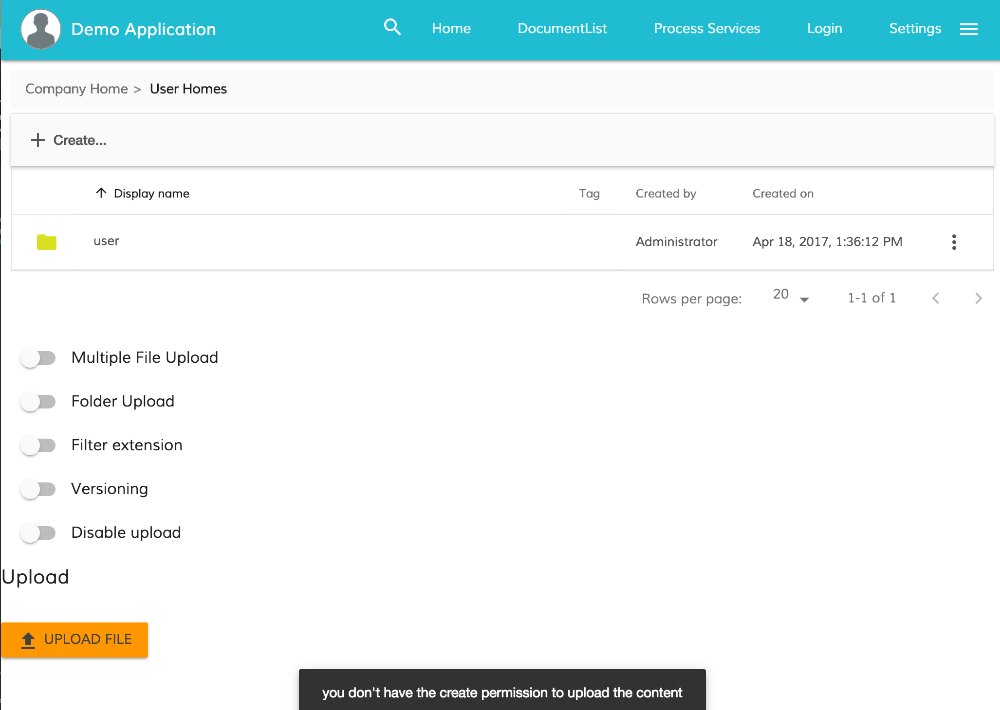
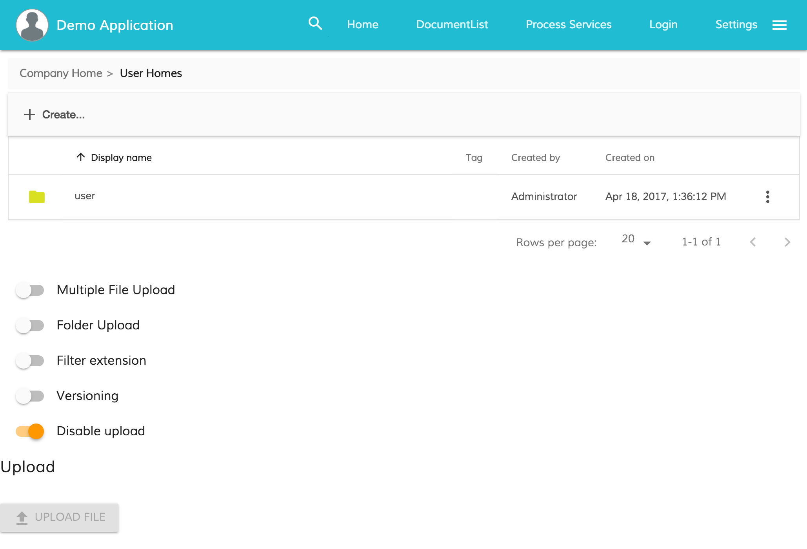

# Alfresco Upload Component

<!-- markdown-toc start - Don't edit this section.  npm run toc to generate it-->

<!-- toc -->

- [Content](#content)
  * [Components](#components)
  * [Services](#services)
  * [Directives](#directives)
- [Prerequisites](#prerequisites)
- [Install](#install)
- [UploadButtonComponent](#uploadbuttoncomponent)
  * [Properties](#properties)
  * [Events](#events)
  * [Advanced usage](#advanced-usage)
    + [How to show notification message with no permission](#how-to-show-notification-message-with-no-permission)
    + [How to disable the button when the delete permission is missing](#how-to-disable-the-button-when-the-delete-permission-is-missing)
- [UploadDragAreaComponent](#uploaddragareacomponent)
  * [Properties](#properties-1)
  * [Events](#events-1)
- [FileUploadingDialogComponent](#fileuploadingdialogcomponent)
  * [Properties](#properties-2)
- [UploadService](#uploadservice)
  * [Ignore list configuration](#ignore-list-configuration)
  * [Events](#events-2)
- [Build from sources](#build-from-sources)
- [NPM scripts](#npm-scripts)
- [Demo](#demo)
- [License](#license)

<!-- tocstop -->

<!-- markdown-toc end -->

## Content

### Components

- [FileUploadingDialogComponent](#fileuploadingdialogcomponent)
- FileUploadingListComponent
- [UploadButtonComponent](#uploadbuttoncomponent)
- [UploadDragAreaComponent](#uploaddragareacomponent)

### Services

- [UploadService](#uploadservice)

### Directives

- FileDraggableDirective

## Prerequisites

Before you start using this development framework, make sure you have installed all required software and done all the
necessary configuration [prerequisites](https://github.com/Alfresco/alfresco-ng2-components/blob/master/PREREQUISITES.md).

> If you plan using this component with projects generated by Angular CLI, please refer to the following article: [Using ADF with Angular CLI](https://github.com/Alfresco/alfresco-ng2-components/wiki/Angular-CLI)

## Install

```sh
npm install ng2-alfresco-upload
```

## UploadButtonComponent

```html
<adf-upload-button 
    [parentId]="-my-"
    [uploadFolders]="true"
    [multipleFiles]="false"
    [acceptedFilesType]=".jpg,.gif,.png,.svg"
    [versioning]="false"
    (onSuccess)="customMethod($event)">
</adf-upload-button>
<file-uploading-dialog></file-uploading-dialog>
```

### Properties

| Name | Type | Default | Description |
| --- | --- | --- | --- |
| disabled | boolean | false | Toggle component disabled state |
| **(deprecated)** showNotificationBar | boolean | true | Hide/show notification bar. **Deprecated in 1.6.0: use UploadService events and NotificationService api instead.** |
| uploadFolders | boolean | false | Allow/disallow upload folders (only for Chrome) |
| multipleFiles | boolean | false | Allow/disallow multiple files |
| acceptedFilesType | string | * |  array of allowed file extensions , example: ".jpg,.gif,.png,.svg" |
| **(deprecated)** currentFolderPath | string | '/Sites/swsdp/documentLibrary' | define the path where the files are uploaded. **Deprecated in 1.6.0: use rootFolderId instead.** |
| **(deprecated)** rootFolderId | string | '-root-' | The ID of the root folder node.
**Deprecated in 1.6.2: use parentId instead.** |
| parentId | string | empty | The ID of the root. It can be the nodeId if you are using the upload for the Content Service or taskId/processId for the Process Service. |
| versioning | boolean | false | Versioning false is the default uploader behaviour and it renames the file using an integer suffix if there is a name clash. Versioning true to indicate that a major version should be created |
| staticTitle | string | (predefined) | define the text of the upload button |
| disableWithNoPermission | boolean | false |  If the value is true and the user doesn't have the permission to delete the node the button will be disabled |
| tooltip | string | | Custom tooltip |

### Events

| Name | Description |
| --- | --- |
| onSuccess | Raised when the file is uploaded |

### Advanced usage

#### How to show notification message with no permission

You can show a notification error when the user doesn't have the right permission to perform the action.
The UploadButtonComponent provides the event permissionEvent that is raised when the delete permission is missing
You can subscribe to this event from your component and use the NotificationService to show a message.

```html
<adf-upload-button
    [rootFolderId]="currentFolderId"
    (permissionEvent)="onUploadPermissionFailed($event)">
</adf-upload-button>
```

```ts
export class MyComponent {

    onUploadPermissionFailed(event: any) {
        this.notificationService.openSnackMessage(
            `you don't have the ${event.permission} permission to ${event.action} the ${event.type} `, 4000
        );
    }

}
```



#### How to disable the button when the delete permission is missing

You can easily disable the button when the user doesn't have the permission to perform the action.
The UploadButtonComponent provides the property disableWithNoPermission that can be true. In this way the button should be disabled if the delete permission is missing for the node.

```html
<adf-upload-button
    [rootFolderId]="currentFolderId"
    [disableWithNoPermission]="true">
</adf-upload-button>
```



## UploadDragAreaComponent

This component provides a drag and drop area to upload files to Alfresco.

```html
<adf-upload-drag-area (onSuccess)="customMethod($event)">
    <div style="width: 200px; height: 100px; border: 1px solid #888888">
        DRAG HERE
    </div>
</adf-upload-drag-area>
<file-uploading-dialog></file-uploading-dialog>
```

```ts
export class AppComponent {

    public onSuccess(event: Object): void {
        console.log('File uploaded');
    }

}
```

### Properties

| Name | Type | Default | Description |
| --- | --- | --- | --- |
| enabled | boolean | true | Toggle component enabled state |
| **(deprecated)** showNotificationBar | boolean | true |  Hide/show notification bar. **Deprecated in 1.6.0: use UploadService events and NotificationService api instead.** |
| rootFolderId | string | '-root-' | The ID of the root folder node. |
| **(deprecated)** currentFolderPath | string | '/' | define the path where the files are uploaded. **Deprecated in 1.6.0: use rootFolderId instead.** |
| versioning | boolean | false |  Versioning false is the default uploader behaviour and it renames the file using an integer suffix if there is a name clash. Versioning true to indicate that a major version should be created  | 

### Events

| Name | Description |
| --- | --- |
| onSuccess | Raised when the file is uploaded |

## FileUploadingDialogComponent

This component provides a dialog that shows all the files uploaded with upload button or drag & drop area components.
This component should be used in combination with upload button or drag & drop area.

```html
<file-uploading-dialog></file-uploading-dialog>
```

### Properties

| Name | Type | Default | Description |
| --- | --- | --- | --- |
| position | string | 'right' | Dialog position. Accepted values are 'left' or 'right' |

## UploadService

Provides access to various APIs related to file upload features.

### Ignore list configuration

Is possible add an ignore list for files that you don't want to allow upload on your CS.
The configuration of this service is saved in the ***app.config.json file***.If you want more details about the configuration service follow this [link](https://github.com/Alfresco/alfresco-ng2-components/tree/master/ng2-components/ng2-alfresco-core#appconfigservice).
In the example below you can see how filtered out the : '.git', '.DS_Store' and 'desktop.ini'.

**app.config.json**

```json
{
    "ecmHost": "http://localhost:3000/ecm",
    "bpmHost": "http://localhost:3000/bpm",
    "application": {
        "name": "Alfresco"
    },
    "files": {
          "excluded": [".DS_Store", "desktop.ini", ".git"]
    }
}
```

Note:
- Standard glob patterns work.
- You can end patterns with a forward slash / to specify a directory.

### Events

| Name | Type | Description |
| --- | --- | --- |
| queueChanged | FileModel[] | Raised every time the file queue changes. |
| fileUpload | FileUploadEvent | Raised every time a File model changes its state. |
| fileUploadStarting | FileUploadEvent | Raised when upload starts. |
| fileUploadCancelled | FileUploadEvent | Raised when upload gets cancelled by user.  |
| fileUploadProgress | FileUploadEvent | Raised during file upload process and contains the current progress for the particular File model. |
| fileUploadAborted | FileUploadEvent | Raised when file upload gets aborted by the server. |
| fileUploadError | FileUploadEvent | Raised when an error occurs to file upload. |
| fileUploadComplete | FileUploadCompleteEvent | Raised when file upload is complete. |

## Build from sources

You can build component from sources with the following commands:

```sh
npm install
npm run build
```

> The `build` task rebuilds all the code, runs tslint, license checks 
> and other quality check tools before performing unit testing.

## NPM scripts

| Command | Description |
| --- | --- |
| npm run build | Build component |
| npm run test | Run unit tests in the console |
| npm run test-browser | Run unit tests in the browser
| npm run coverage | Run unit tests and display code coverage report |

## Demo

Please check the demo folder for a demo project

```sh
cd demo
npm install
npm start
```

## License

[Apache Version 2.0](https://github.com/Alfresco/alfresco-ng2-components/blob/master/LICENSE)
