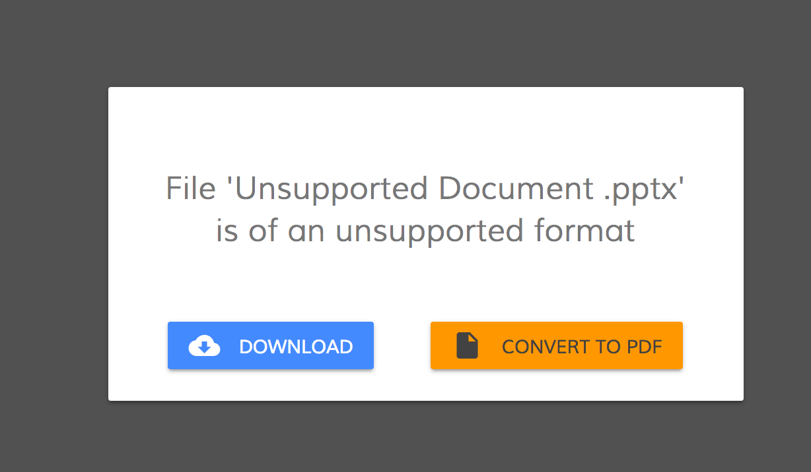

# Alfresco File Viewer library

Contains the Alfresco Viewer component.

<!-- markdown-toc start - Don't edit this section.  npm run toc to generate it-->

<!-- toc -->

- [Alfresco Viewer component](#alfresco-viewer-component)
  * [Basic usage](#basic-usage)
    + [Properties](#properties)
  * [Details](#details)
    + [Supported file formats](#supported-file-formats)
    + [PDF Conversion](#pdf-conversion)
    + [Configuring PDF.js library](#configuring-pdfjs-library)
    + [Custom extension handler](#custom-extension-handler)
- [Project Information](#project-information)
  * [Prerequisites](#prerequisites)
  * [Install](#install)
  * [Build from sources](#build-from-sources)
  * [NPM scripts](#npm-scripts)
  * [Demo](#demo)
  * [License](#license)

<!-- tocstop -->

<!-- markdown-toc end -->

## Alfresco Viewer component

See it live: [Viewer Quickstart](https://embed.plnkr.co/iTuG1lFIXfsP95l6bDW6/)

### Basic usage

Using with node id:

```html
<adf-viewer 
    [showViewer]="true" 
    [overlayMode]="true" 
    [fileNodeId]="'d367023a-7ebe-4f3a-a7d0-4f27c43f1045'">
</adf-viewer>
```

Using with file url:

```html
<adf-viewer 
    [overlayMode]="true" 
    [urlFile]="'filename.pdf'">
</adf-viewer>
```

#### Properties

| Attribute | Options | Default | Description |
| --- | --- | --- | --- |
| fileNodeId | string | | Node Id of the file to load |
| urlFile | string | | If you want to load an external file that does not come from ECM you can use this Url where to load the file |
| urlBlob | Blob | | If you want to load a Blob File |
| overlayMode | boolean | false | If `true` show the Viewer full page over the present content otherwise will fit the parent div |
| showViewer | boolean | true | Hide or show the viewer |
| showToolbar | boolean | true | Hide or show the toolbars |
| displayName | string | | You can specify the name of the file |

### Details

#### Supported file formats

| Type | Extension |
| --- | --- |
| Media | wav, Mp3, Mp4, WebM, Ogv |
| Images | png, jpg, jpeg, gif, bmp |
| Text | pdf, txt |

#### PDF Conversion

                         

Note for unsupported extensions the viewer will offer the possibility to convert to PDF if that kind of extension is supported by the [content service renditions service](https://community.alfresco.com/docs/DOC-5879-rendition-service)

#### Configuring PDF.js library

In order to configure your webpack-enabled application with the PDF.js library please follow the next steps.

Install pdfjs-dist

```sh
npm install pdfjs-dist
```

Update `vendors.ts` by appending the following:

```ts
// PDF.js
require('pdfjs-dist/web/compatibility.js');
const pdfjsLib = require('pdfjs-dist');
pdfjsLib.PDFJS.workerSrc = './pdf.worker.js';
require('pdfjs-dist/web/pdf_viewer.js');
```

The code above enables the "viewer" component and "compatibility" mode for all the browsers.
It also configures the web worker for PDF.js library to render PDF files in the background.

Update the `plugins` section of the `webpack.common.js` file with the next lines:

```js
new CopyWebpackPlugin([
    ...
    {
        from: 'node_modules/pdfjs-dist/build/pdf.worker.js',
        to: 'pdf.worker.js'
    }
])
```

The Viewer component now should be able displaying PDF files.

#### Custom extension handler

If you want to handle other file formats that are not yet supported by the ng2-alfresco-viewer you can define your own custom handler.

Below you can find an example with the use of `extension-viewer` if you can handle 3d files

```html
<adf-viewer 
    [(showViewer)]="fileShowed"
    [fileNodeId]="fileNodeId"
    [overlayMode]="true">
    
    <extension-viewer [supportedExtensions]="['obj','3ds']" #extension>
        <template let-urlFileContent="urlFileContent" let-extension="extension">
            <threed-viewer 
                [urlFile]="urlFileContent" 
                [extension]="extension">
            </threed-viewer>
        </template>
    </extension-viewer>

</adf-viewer> 
```

Note: you need adding `ng2-3d-editor` dependency to your `package.json` file to make the example above work.

It is possible to define multiple `extension-viewer` templates:

```html
<adf-viewer 
    [(showViewer)]="fileShowed"
    [fileNodeId]="fileNodeId"
    [overlayMode]="true">

    <extension-viewer [supportedExtensions]="['xls','xlsx']" #extension>
        <template let-urlFileContent="urlFileContent"  >
            <my-custom-xls-component 
                urlFileContent="urlFileContent">
            </my-custom-xls-component>
        </template>
    </extension-viewer>

    <extension-viewer [supportedExtensions]="['txt']" #extension>
        <template  let-urlFileContent="urlFileContent" >               
            <my-custom-txt-component 
                urlFileContent="urlFileContent">
            </my-custom-txt-component>
        </template>
    </extension-viewer>
</adf-viewer> 
```

## Project Information

### Prerequisites

Before you start using this development framework, make sure you have installed all required software and done all the
necessary configuration [prerequisites](https://github.com/Alfresco/alfresco-ng2-components/blob/master/PREREQUISITES.md).

> If you plan using this component with projects generated by Angular CLI, please refer to the following article: [Using ADF with Angular CLI](https://github.com/Alfresco/alfresco-ng2-components/wiki/Angular-CLI)

### Install

```sh
npm install ng2-alfresco-viewer
```

### Build from sources

You can build component from sources with the following commands:

```sh
npm install
npm run build
```

> The `build` task rebuilds all the code, runs tslint, license checks 
> and other quality check tools before performing unit testing.

### NPM scripts

| Command | Description |
| --- | --- |
| npm run build | Build component |
| npm run test | Run unit tests in the console |
| npm run test-browser | Run unit tests in the browser
| npm run coverage | Run unit tests and display code coverage report |

### Demo

Please check the demo folder for a demo project

```sh
cd demo
npm install
npm start
```

### License

[Apache Version 2.0](https://github.com/Alfresco/alfresco-ng2-components/blob/master/LICENSE)
